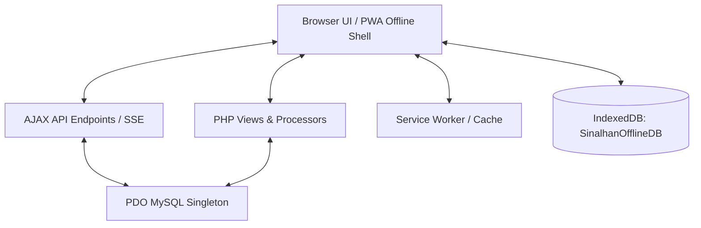
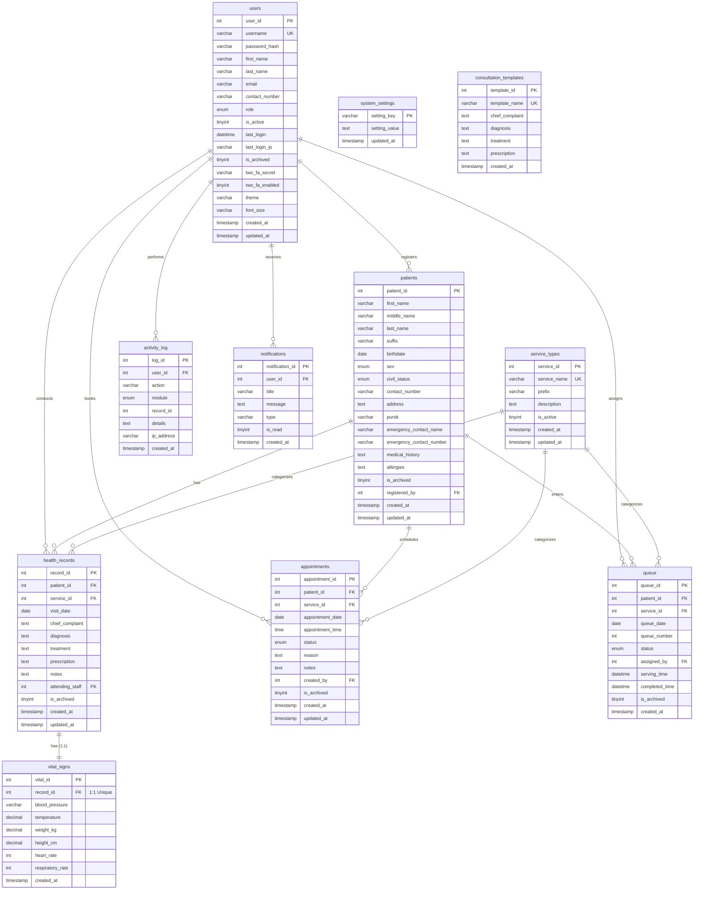

# Barangay Sinalhan Patient Management System - Implementation Details

This document details the system design, file interactions, database schema relationships, API endpoints, and business workflows of the Barangay Sinalhan Patient Management System.

---

## 🏛️ System Architecture

The application is built on a **Native PHP + MySQL** model utilizing a modular procedural architecture. It operates under a local client-server network deployment schema (e.g. using XAMPP) with client-side synchronization engines.

### Core Architecture Components:
1. **Singleton Database Connection:** Access is controlled via a singleton class (`config/database.php`), which instantiates a single `PDO` handle per page request. Native prepared statements are forced (`PDO::ATTR_EMULATE_PREPARES => false`) to mitigate SQL Injection risks.
2. **Session Security & Timeout Monitor:** `config/session.php` applies HTTP-only, SameSite=Strict cookies and checks idle timestamps to automatically terminate user sessions after 30 minutes of inactivity.
3. **OpenSSL AES-256-CBC Encryption Engine:** The encryption module (`includes/encryption.php`) encrypts columns in `patients` and `health_records` tables. It prefixes ciphertexts with `enc::[iv]::[ciphertext]` to enable dynamic legacy fallbacks for unencrypted cells.
4. **PWA Offline Shell & IndexedDB:** Service Worker caching (`service-worker.js`) intercepts network fetches to load pages offline. If the client register form goes offline, patient details are written to the browser's `IndexedDB` (`SinalhanOfflineDB` / `pending_patients` store) and synced back once online.

---

## 📊 Database Relationships

The MySQL database schema contains 11 tables. Relationships, cardinality constraints, and index mappings are shown below:

---

## 🔌 API Endpoints (AJAX)

The application utilizes internal endpoints returning JSON payloads or Server-Sent Events (SSE):

| Endpoint | Method | Input Parameters | Output Payload | Description |
| :--- | :---: | :--- | :--- | :--- |
| `ajax/search_patients.php` | `GET` | `q` (string query) | `{ results: [...] }` | Performs matching against patient first/last/middle names. Returns ages, Puroks, and IDs. |
| `ajax/check_duplicate.php` | `GET` | `first_name`, `last_name`, `birthdate` | `{ hasDuplicate: bool, matches: [...] }` | Triggered on blur of demographic form inputs to block creation of duplicate patient records. |
| `ajax/get_template.php` | `GET` | `id` (template_id) | `{ success: bool, template: {...} }` | Fetches pre-seeded template records to auto-populate chief complaints, diagnoses, treatments, and prescriptions. |
| `ajax/notifications_feed.php` | `GET` / `POST` | `action` ('mark_read' or 'mark_all_read'), `csrf_token` | `{ success: bool, notifications: [...], count: int }` | Manages the top navbar dropdown feed. Broadcasts warning signals if client has pending IndexedDB sync records. |
| `ajax/queue_sse.php` | `GET` | *Persistent Keep-Alive Connection* | SSE Event Stream | Streams live Waiting Room queue tickets. Relies on state hash monitoring to run optimized queries. |
| `ajax/update_preferences.php` | `POST` | `theme` ('light'/'dark'), `font_size` ('normal'/'medium'/'large'), `csrf_token` | `{ success: bool }` | Dynamically updates user preference variables and database records without reloading. |
| `ajax/active_queue.php` | `GET` | None | `{ success: bool, queue: [...] }` | Returns active walk-in lists. |
| `ajax/active_users.php` | `GET` | None | `{ success: bool, users: [...] }` | Returns active users logged into the system (Admin only). |
| `ajax/dashboard_stats.php` | `GET` | None | `{ success: bool, ...stats }` | Fetches live aggregates for admin charts. |

---

## 🔄 Business Workflows & Logic

### 1. Patient Registration & Duplicate Prevention
- BHW or Staff enters patient data. On blur of the name and birthdate fields, an AJAX request searches for active records.
- If a match is found, a warning banner prevents submission.
- On submit, `register_process.php` encrypts medical history and allergies, writes to the `patients` table, and logs the registration.

### 2. Walk-in Queue and SSE Streaming
1. Walk-in patient arrives. BHW/Staff calls `queue/assign.php`, selects the patient and service type, and issues a sequence ticket.
2. The queue ticket uses a custom prefix based on the service (e.g. `GEN` for general, yielding `GEN-001`).
3. The queue record is written to the database with a default status of `'Waiting'`.
4. The waiting room TV monitor runs `queue/display.php`, establishing an SSE event stream to `ajax/queue_sse.php`.
5. When staff changes a ticket status (e.g. from `'Waiting'` to `'Serving'`), the SSE stream detects the state hash change, pushes data packages, and the client displays the update using chime sound alerts and Text-to-Speech vocal call-outs.

### 3. Cryptographic Master Key Rotation
- Form inside **Administration > System Settings > Key Rotation** requests a new 16+ character master key.
- The controller:
  1. Opens a database transaction.
  2. Pulls all patient history/allergy records, decrypts them with the old key, and re-encrypts them with the new key.
  3. Pulls all health consultation records (complaints, diagnoses, treatments, prescriptions, notes), decrypts, and re-encrypts.
  4. Modifies the configuration file (`config/app.php`) dynamically, updating the `ENCRYPTION_KEY` constant definition.
  5. Commits the transaction and logs the key rotation audit event.

---

## ⚙️ Key System Design Decisions

1. **Transaction-Level Integrity:** Critical state operations (e.g. queue generation, key rotation, bulk overdue status transitions) are wrapped in PDO transactions (`beginTransaction()`, `commit()`, `rollBack()`) to ensure absolute data consistency.
2. **Transparent Decryption Fallback:** Cryptographic decryption checks for the `'enc::'` prefix. If absent, it returns the raw value. This protects legacy data from throwing execution errors when key rotation occurs or during initial imports.
3. **Session Blocking Mitigation:** Long-polling or persistent connection streams (specifically `ajax/queue_sse.php`) call `session_write_close()` early. This unlocks the PHP session file on the server, permitting the user to navigate the rest of the application concurrently.
4. **Native SQL Exporter:** Rather than relying on external command line utilities like `mysqldump` which may not be in the path environment on standard client setups, database backups are generated inside PHP by querying table schemas and values natively.
