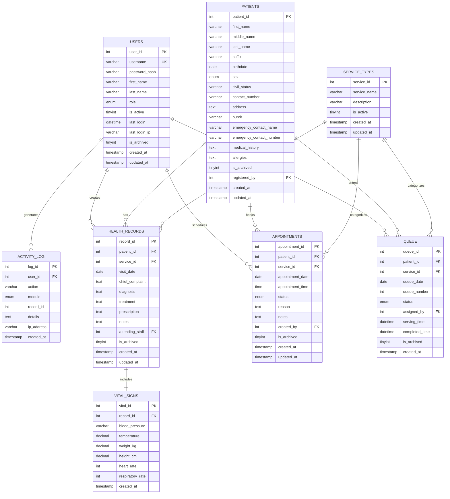

# Web-Based Patient Management System for Barangay Sinalhan Santa Rosa Health Center

**Project Title:** Web-Based Patient Management System for Barangay Sinalhan Santa Rosa Health Center  
**Institution:** Trimex Colleges — Bachelor of Science in Information Technology (BSIT)  
**Location:** Barangay Sinalhan, Santa Rosa City, Laguna, Philippines  
**Project Type:** Capstone Project  
**Date:** May 29, 2026

---

## Table of Contents

- [Phase 1 — System Planning](#phase-1--system-planning)
- [Phase 2 — Database Design](#phase-2--database-design)
- [Phase 3 — Frontend Planning](#phase-3--frontend-planning)
- [Phase 4 — Backend Planning (PHP)](#phase-4--backend-planning-php)
- [Phase 5 — UI/UX Design Strategy](#phase-5--uiux-design-strategy)
- [Phase 6 — Development Strategy](#phase-6--development-strategy)
- [Phase 7 — Security Planning](#phase-7--security-planning)
- [Phase 8 — Testing Plan](#phase-8--testing-plan)
- [Phase 9 — Queue Display Feature](#phase-9--queue-display-feature-special-module)
- [Phase 10 — Deployment and Handover Plan](#phase-10--deployment-and-handover-plan)

---

# Phase 1 — System Planning

## 1.1 Project Overview

The Web-Based Patient Management System for Barangay Sinalhan Santa Rosa Health Center is a locally-deployed web application designed to digitize and streamline the patient management operations of a barangay-level public health facility. The system replaces paper-based processes for patient registration, health record-keeping, appointment scheduling, and walk-in queue management with a centralized, role-based digital platform.

The system targets three internal user roles — **Administrator**, **Health Center Staff**, and **Barangay Health Workers (BHW)** — as well as a public-facing queue display for walk-in patients. It is built using a traditional PHP/MySQL stack optimized for local network deployment via XAMPP, making it practical for barangay health centers with limited IT infrastructure.

This project is developed as a capstone requirement under the BSIT program at Trimex Colleges and adheres to SDLC methodology, ISO 9126 software quality standards, and the Philippine Data Privacy Act of 2012 (RA 10173).

## 1.2 Core Objectives (Aligned with ISO 9126)

| ISO 9126 Quality | Objective |
|---|---|
| **Functionality** | Provide complete CRUD operations for patient records, appointments, queue management, and user administration with role-based access control. |
| **Reliability** | Ensure data integrity through archive-over-delete strategy, foreign key constraints, and comprehensive input validation. The system must handle concurrent users without data loss. |
| **Usability** | Design an intuitive, clean interface following Jakob Nielsen's usability heuristics, suitable for non-technical health center staff with minimal training. |
| **Efficiency** | Optimize page load times and database queries for smooth operation on local network hardware. AJAX-based features (queue display, duplicate detection) must respond within 2 seconds. |
| **Maintainability** | Organize PHP code in a modular, well-documented structure that allows future developers to extend functionality without restructuring the codebase. |
| **Portability** | Deploy on any machine running XAMPP (Windows/Linux), ensuring the system is not tied to proprietary infrastructure. |

## 1.3 Target Users and Role Descriptions

### Administrator
The Administrator has the **highest level of access** in the system with full CRUD + Archive authority across all modules. This role is typically assigned to the Health Center Head or IT-designated personnel.

**Capabilities:**
- Manage all user accounts (create, edit, deactivate staff and BHW accounts, reset passwords)
- View system-wide dashboard with summary statistics and Chart.js visualizations
- Monitor active/logged-in users and login activity
- Manage service types (add, edit, deactivate categories like Prenatal, Dental, Immunization)
- Register new patients (with duplicate detection)
- Full CRUD + Archive access to patient records (create, read, update, archive)
- Full CRUD + Archive access to health records / consultations (create, read, update, archive)
- Full CRUD + Archive access to appointments (create, read, update, archive)
- Full access to queue management (assign, update status, archive)
- View and restore archived records across all modules
- Generate filtered reports (by date range, module, service type, purok) exportable as PDF
- View the complete system activity log (audit trail)

### Health Center Staff
Staff members handle daily clinical and operational tasks. This role is assigned to nurses, midwives, and other health center personnel who interact directly with patients. Staff have **CRU access (Create, Read, Update) but cannot archive** records — only the Admin can archive.

**Capabilities:**
- Register new patients (with automatic duplicate detection)
- Create, view, and update patient records (no archive)
- Record consultation history with vital signs per visit (create, view, update — no archive)
- Schedule, update, and monitor patient appointments (create, view, update — no archive)
- Manage walk-in patient queue (assign numbers, update serving/served/no-show statuses — no archive)
- View real-time queue display

### Barangay Health Worker (BHW)
BHWs are community health volunteers with limited system access. They assist in patient registration and queue management during peak hours.

**Capabilities:**
- Register new patients (create-only, cannot edit or archive)
- View patient records (read-only, no edit or archive access)
- View appointment records (read-only)
- Assign queue numbers to walk-in patients (create-only)

### Walk-in Patient (Non-User)
Walk-in patients are not system users. They interact only with the public-facing queue display screen.

**Interaction:**
- Receive a queue number assigned by staff or BHW
- View their queue status on a dedicated public display (TV/monitor in the waiting area)

## 1.4 Functional Requirements (Per Module)

### Authentication Module
| ID | Requirement | Roles |
|---|---|---|
| AUTH-01 | Secure login with username and password | All |
| AUTH-02 | Session-based authentication with timeout | All |
| AUTH-03 | Role-based redirection after login | All |
| AUTH-04 | Logout with session destruction | All |
| AUTH-05 | Password change from profile page | All |
| AUTH-06 | Login activity tracking (last login timestamp, IP) | System |

### Admin Module
| ID | Requirement | Roles |
|---|---|---|
| ADM-01 | User account CRUD (add, edit, deactivate, reset password) | Admin |
| ADM-02 | Role assignment and modification | Admin |
| ADM-03 | System-wide dashboard with summary cards and charts | Admin |
| ADM-04 | Activity log viewer (filterable by user, module, date) | Admin |
| ADM-05 | Service type management (add, edit, deactivate) | Admin |
| ADM-06 | View all patient records with filters | Admin |
| ADM-07 | View and restore archived records (patients, appointments, queue) | Admin |
| ADM-08 | Report generation with filters (date, module, service type, purok) | Admin |
| ADM-09 | Export reports as PDF or printable view | Admin |
| ADM-10 | Monitor active/logged-in users | Admin |

### Patient Records Module
| ID | Requirement | Roles |
|---|---|---|
| PAT-01 | Register new patient with demographic information | Admin, Staff, BHW |
| PAT-02 | Duplicate detection during registration (by name + birthdate) | Admin, Staff, BHW |
| PAT-03 | View patient list with search and filter (by purok, name) | Admin (full), Staff (full), BHW (view-only) |
| PAT-04 | View individual patient profile and history | Admin (full), Staff (full), BHW (view-only) |
| PAT-05 | Update patient demographic information | Admin, Staff |
| PAT-06 | Archive patient record (soft-delete) | Admin |
| PAT-07 | View archived patients | Admin |
| PAT-08 | Restore archived patient record | Admin |

### Health Records / Consultation Module
| ID | Requirement | Roles |
|---|---|---|
| HRC-01 | Create new consultation record for a patient | Admin, Staff |
| HRC-02 | Record vital signs per visit (BP, temp, weight, height) | Admin, Staff |
| HRC-03 | Record diagnosis, treatment, and notes | Admin, Staff |
| HRC-04 | View consultation history per patient | Admin (full), Staff (full), BHW (view-only) |
| HRC-05 | Update existing consultation record | Admin, Staff |
| HRC-06 | Archive consultation record | Admin |

### Appointment Module
| ID | Requirement | Roles |
|---|---|---|
| APT-01 | Schedule new appointment (patient, date, time, service type) | Admin, Staff |
| APT-02 | View appointment list with filters (date, status, service type) | Admin (full), Staff (full), BHW (view-only) |
| APT-03 | Update appointment details | Admin, Staff |
| APT-04 | Update appointment status (Scheduled → Completed / Cancelled / No-Show) | Admin, Staff |
| APT-05 | Archive appointment record | Admin |
| APT-06 | View and restore archived appointments | Admin |

### Queue Management Module
| ID | Requirement | Roles |
|---|---|---|
| QUE-01 | Assign queue number to walk-in patient | Admin, Staff, BHW |
| QUE-02 | Auto-increment queue number per day (resets daily) | System |
| QUE-03 | Update queue status (Waiting → Serving → Served / No-Show) | Admin, Staff |
| QUE-04 | View current queue list for the day | Admin (full), Staff (full), BHW (view-only) |
| QUE-05 | Public queue display page (no authentication required) | Public |
| QUE-06 | Auto-refresh queue display (AJAX polling every 3–5 seconds) | System |
| QUE-07 | View historical queue data by date | Admin |
| QUE-08 | Archive queue entry | Admin |

### Activity Log Module
| ID | Requirement | Roles |
|---|---|---|
| LOG-01 | Automatically log all major CRUD operations | System |
| LOG-02 | Record user ID, action, module, record ID, IP, timestamp | System |
| LOG-03 | View activity log with filters | Admin |
| LOG-04 | Activity log is write-only (no edit/delete for any user) | System |

## 1.5 Non-Functional Requirements

| Category | Requirement |
|---|---|
| **Performance** | Pages must load within 3 seconds on local network. AJAX responses within 2 seconds. |
| **Scalability** | Support up to 10 concurrent users on local network. Database should handle 10,000+ patient records. |
| **Availability** | System available during health center operating hours (8 AM – 5 PM, Mon–Sat). |
| **Security** | Password hashing, prepared statements, XSS prevention, CSRF tokens, session security. |
| **Compatibility** | Chrome 90+ and Edge 90+ on Windows 10/11. |
| **Data Privacy** | Compliance with RA 10173 (Philippine Data Privacy Act of 2012). |
| **Backup** | Manual database backup via phpMyAdmin SQL export. Backup schedule recommended weekly. |
| **Maintainability** | Modular PHP file structure with inline documentation and consistent naming conventions. |

## 1.6 Recommended System Architecture

```
┌─────────────────────────────────────────────────────────────┐
│                      CLIENT LAYER                           │
│  ┌──────────┐  ┌──────────┐  ┌──────────┐  ┌────────────┐  │
│  │ Admin PC │  │ Staff PC │  │  BHW PC  │  │Queue Display│  │
│  │ (Chrome) │  │ (Chrome) │  │ (Chrome) │  │  (TV/Mon)  │  │
│  └────┬─────┘  └────┬─────┘  └────┬─────┘  └─────┬──────┘  │
│       │              │              │              │         │
└───────┼──────────────┼──────────────┼──────────────┼─────────┘
        │              │              │              │
        └──────────────┼──────────────┼──────────────┘
                       │         LAN (HTTP)
                       ▼
┌─────────────────────────────────────────────────────────────┐
│                    SERVER LAYER (XAMPP)                      │
│  ┌───────────────────────────────────────────────────────┐  │
│  │                 Apache Web Server                      │  │
│  │  ┌─────────────────────────────────────────────────┐  │  │
│  │  │              PHP Application                     │  │  │
│  │  │  ┌──────────┐ ┌──────────┐ ┌──────────────────┐ │  │  │
│  │  │  │   Auth   │ │  RBAC    │ │  Session Manager │ │  │  │
│  │  │  │  Guard   │ │  Guard   │ │                  │ │  │  │
│  │  │  └──────────┘ └──────────┘ └──────────────────┘ │  │  │
│  │  │  ┌──────────┐ ┌──────────┐ ┌──────────────────┐ │  │  │
│  │  │  │ Patient  │ │Appointm. │ │  Queue Module    │ │  │  │
│  │  │  │ Module   │ │ Module   │ │                  │ │  │  │
│  │  │  └──────────┘ └──────────┘ └──────────────────┘ │  │  │
│  │  │  ┌──────────┐ ┌──────────┐ ┌──────────────────┐ │  │  │
│  │  │  │  Admin   │ │ Reports  │ │  Activity Log    │ │  │  │
│  │  │  │ Module   │ │ Module   │ │                  │ │  │  │
│  │  │  └──────────┘ └──────────┘ └──────────────────┘ │  │  │
│  │  └─────────────────────────────────────────────────┘  │  │
│  └───────────────────────────────────────────────────────┘  │
│  ┌───────────────────────────────────────────────────────┐  │
│  │              MySQL Database Server                     │  │
│  │              Database: bhc_sinalhan_db                 │  │
│  └───────────────────────────────────────────────────────┘  │
└─────────────────────────────────────────────────────────────┘
```

**Architecture Pattern:** Monolithic PHP Application (appropriate for capstone scope)  
**Communication:** Synchronous HTTP requests + AJAX for real-time features  
**Data Flow:** Client → Apache → PHP → MySQL → PHP → Client

## 1.7 Development Roadmap

| Phase | Duration | Key Deliverables |
|---|---|---|
| Planning & Design | Week 1–2 | Implementation plan, database design, UI wireframes |
| Project Setup | Week 3 | Folder structure, XAMPP config, database creation, seeding |
| Authentication | Week 3–4 | Login, session management, RBAC guards |
| Admin Module | Week 4–6 | User management, service types, activity log, dashboard |
| Patient Module | Week 6–8 | Registration, patient list, health records, consultations |
| Appointment Module | Week 8–9 | Scheduling, status tracking, archive/restore |
| Queue Module | Week 9–10 | Queue assignment, status management, public display |
| Reports & PDF | Week 10–11 | Report generation, PDF export, dashboard charts |
| Testing | Week 11–13 | Unit, integration, system, acceptance testing |
| Polish & Deploy | Week 13–14 | Bug fixes, UI polish, deployment, handover documentation |

**Total Estimated Duration:** 14 weeks (one academic semester)

## 1.8 Suggested Folder/File Structure

```
bhc-sinalhan/
├── index.php                          # Entry point → redirects to login
├── config/
│   ├── database.php                   # PDO connection (singleton)
│   ├── app.php                        # App constants (site name, version)
│   └── session.php                    # Session configuration and start
├── includes/
│   ├── header.php                     # HTML head, navbar, CSS links
│   ├── sidebar.php                    # Role-aware sidebar navigation
│   ├── footer.php                     # Footer, JS scripts
│   ├── auth_guard.php                 # Session check → redirect if not logged in
│   ├── role_guard.php                 # Role check → redirect if unauthorized
│   ├── alert.php                      # SweetAlert2 session flash messages
│   └── log_activity.php              # Activity log writer function
├── auth/
│   ├── login.php                      # Login form and processing
│   ├── login_process.php              # Login authentication logic
│   ├── logout.php                     # Session destroy and redirect
│   ├── profile.php                    # View/edit profile
│   └── change_password.php           # Password change form and processing
├── admin/
│   ├── dashboard.php                  # Admin dashboard with charts
│   ├── users.php                      # User account list
│   ├── user_add.php                   # Add new user form
│   ├── user_edit.php                  # Edit user form
│   ├── user_process.php               # User CRUD processing
│   ├── user_reset_password.php        # Reset user password
│   ├── service_types.php              # Service type management
│   ├── service_type_process.php       # Service type CRUD processing
│   ├── activity_log.php               # Activity log viewer
│   ├── archived_records.php           # Archived records viewer + restore
│   ├── archive_process.php            # Archive restore processing
│   ├── reports.php                    # Report generation page
│   ├── report_generate.php            # Report data processing
│   └── report_pdf.php                 # PDF report generation
├── patients/
│   ├── list.php                       # Patient list with search/filter
│   ├── register.php                   # Patient registration form
│   ├── register_process.php           # Registration processing
│   ├── view.php                       # Patient profile view
│   ├── edit.php                       # Edit patient form
│   ├── edit_process.php               # Edit processing
│   └── archive_process.php           # Archive/restore patient
├── health_records/
│   ├── list.php                       # Consultation history per patient
│   ├── add.php                        # New consultation form
│   ├── add_process.php                # Consultation save processing
│   ├── view.php                       # View consultation details
│   ├── edit.php                       # Edit consultation form
│   ├── edit_process.php               # Edit processing
│   └── archive_process.php           # Archive consultation
├── appointments/
│   ├── list.php                       # Appointment list with filters
│   ├── add.php                        # New appointment form
│   ├── add_process.php                # Appointment save processing
│   ├── edit.php                       # Edit appointment form
│   ├── edit_process.php               # Edit processing
│   ├── status_update.php             # Status change processing
│   └── archive_process.php           # Archive appointment
├── queue/
│   ├── manage.php                     # Queue management page (staff view)
│   ├── assign.php                     # Assign queue number form
│   ├── assign_process.php             # Queue assignment processing
│   ├── status_update.php             # Queue status change processing
│   └── display.php                    # Public queue display (no auth)
├── ajax/
│   ├── check_duplicate.php            # AJAX duplicate patient check
│   ├── queue_status.php               # AJAX queue current status
│   ├── dashboard_stats.php            # AJAX dashboard data refresh
│   └── active_users.php              # AJAX active users list
├── assets/
│   ├── css/
│   │   ├── style.css                  # Main custom stylesheet
│   │   ├── login.css                  # Login page styles
│   │   ├── dashboard.css              # Dashboard-specific styles
│   │   ├── queue-display.css          # Queue display styles
│   │   └── print.css                  # Print-friendly styles
│   ├── js/
│   │   ├── main.js                    # Shared JavaScript functions
│   │   ├── dashboard.js               # Chart.js dashboard logic
│   │   ├── datatables-init.js         # DataTables initialization
│   │   ├── form-validation.js         # Client-side form validation
│   │   ├── queue-display.js           # Queue display auto-refresh
│   │   └── duplicate-check.js        # AJAX duplicate detection
│   ├── img/
│   │   ├── logo.png                   # Health center logo
│   │   ├── favicon.ico                # Browser favicon
│   │   └── login-bg.jpg              # Login page background
│   └── vendor/
│       ├── bootstrap/                 # Bootstrap 5 CSS/JS
│       ├── bootstrap-icons/           # Bootstrap Icons
│       ├── jquery/                    # jQuery
│       ├── datatables/                # DataTables.js
│       ├── sweetalert2/               # SweetAlert2
│       ├── chart.js/                  # Chart.js
│       └── fpdf/                      # FPDF library
├── reports/
│   └── generated/                     # Temporary generated PDF reports
└── sql/
    ├── bhc_sinalhan_db.sql            # Complete database schema
    └── seed_data.sql                  # Initial seeding data
```

## 1.9 Security Considerations for Healthcare Data

1. **Password Security:** All passwords hashed using PHP `password_hash()` with `PASSWORD_DEFAULT` (bcrypt). Never store plaintext passwords.
2. **SQL Injection Prevention:** All database queries use PDO prepared statements with parameterized bindings. No raw SQL concatenation.
3. **XSS Prevention:** All user-generated output escaped with `htmlspecialchars($value, ENT_QUOTES, 'UTF-8')` before rendering.
4. **CSRF Protection:** Every form includes a hidden CSRF token validated server-side before processing.
5. **Session Security:** `session_regenerate_id(true)` on login, session timeout after 30 minutes of inactivity, `httponly` and `secure` (when applicable) cookie flags.
6. **Role Enforcement:** Every protected page includes `auth_guard.php` (checks session) AND `role_guard.php` (checks role). Admin pages verify `$_SESSION['role'] === 'admin'` explicitly.
7. **Data Privacy (RA 10173):** Patient data stored only on local server. No cloud transmission. Access restricted by role. Activity log provides accountability. Consent for data collection should be obtained during patient registration.
8. **Archive Over Delete:** Medical records are never permanently deleted to maintain audit trail integrity and comply with healthcare data retention requirements.

## 1.10 Session Management Strategy

```php
// config/session.php
<?php
// Session configuration
ini_set('session.cookie_httponly', 1);     // Prevent JS access to session cookie
ini_set('session.use_only_cookies', 1);    // Prevent session fixation via URL
ini_set('session.cookie_samesite', 'Strict'); // CSRF protection
ini_set('session.gc_maxlifetime', 1800);   // 30-minute session lifetime

session_start();

// Session timeout check
if (isset($_SESSION['last_activity'])) {
    if (time() - $_SESSION['last_activity'] > 1800) { // 30 minutes
        session_unset();
        session_destroy();
        header('Location: /auth/login.php?timeout=1');
        exit;
    }
}
$_SESSION['last_activity'] = time();
```

**Session Variables Stored After Login:**
- `$_SESSION['user_id']` — User's primary key
- `$_SESSION['username']` — Username for display
- `$_SESSION['full_name']` — Full name for display
- `$_SESSION['role']` — Role enum value ('admin', 'staff', 'bhw')
- `$_SESSION['last_activity']` — Timestamp of last activity
- `$_SESSION['login_time']` — Timestamp of login
- `$_SESSION['csrf_token']` — CSRF token for form validation

## 1.11 Role-Based Access Control (RBAC) Strategy

RBAC is enforced at **three levels**:

### Level 1: Database Level
The `users` table uses an `ENUM('admin', 'staff', 'bhw')` field for the role column, preventing invalid role values at the data layer.

### Level 2: Server-Side Guards (PHP)
Two guard files are included at the top of every protected page:

```php
// includes/auth_guard.php — Checks if user is logged in
<?php
if (!isset($_SESSION['user_id'])) {
    header('Location: /auth/login.php');
    exit;
}

// includes/role_guard.php — Checks if user has required role
<?php
function require_role($allowed_roles) {
    if (!in_array($_SESSION['role'], $allowed_roles)) {
        $_SESSION['alert'] = [
            'type' => 'error',
            'title' => 'Unauthorized',
            'message' => 'You do not have permission to access this page.'
        ];
        header('Location: /auth/login.php');
        exit;
    }
}
```

**Usage in admin pages:**
```php
<?php
require_once '../config/session.php';
require_once '../includes/auth_guard.php';
require_once '../includes/role_guard.php';
require_role(['admin']); // Only admin can access
```

### Level 3: UI Level (Sidebar Navigation)
The sidebar dynamically renders navigation links based on `$_SESSION['role']`, hiding links to pages the user cannot access. This is a UX convenience — security is enforced server-side regardless.

### Access Matrix

| Page / Feature | Admin | Staff | BHW |
|---|:---:|:---:|:---:|
| Admin Dashboard | ✅ | ❌ | ❌ |
| User Management | ✅ | ❌ | ❌ |
| Service Type Management | ✅ | ❌ | ❌ |
| Activity Log | ✅ | ❌ | ❌ |
| Archived Records (Restore) | ✅ | ❌ | ❌ |
| Report Generation | ✅ | ❌ | ❌ |
| Staff/BHW Dashboard | ❌ | ✅ | ✅ |
| Patient Registration | ✅ (full) | ✅ (full) | ✅ (create-only) |
| Patient List | ✅ (CRUD+Archive) | ✅ (CRU) | ✅ (view-only) |
| Health Records | ✅ (CRUD+Archive) | ✅ (CRU) | ✅ (view-only) |
| Appointments | ✅ (CRUD+Archive) | ✅ (CRU) | ✅ (view-only) |
| Queue Management | ✅ (CRUD+Archive) | ✅ (CRU) | ✅ (assign-only) |
| Queue Display (Public) | ✅ | ✅ | ✅ |
| Profile / Change Password | ✅ | ✅ | ✅ |

> [!IMPORTANT]
> **Key RBAC Principle:** Admin = full CRUD + Archive (highest authority). Staff = CRU only (no archive/delete). BHW = Create + Read only (most restricted). Only the Admin can archive or restore records, ensuring tighter control over healthcare data integrity.

## 1.12 Data Integrity Principles — Archive Over Delete

### Rationale
In healthcare systems, **permanent deletion of records is never acceptable** because:

1. **Legal Compliance:** The Philippine Data Privacy Act (RA 10173) and healthcare regulations require retention of medical records for a minimum period. Deletion could violate these requirements.
2. **Audit Trail Integrity:** The activity log references record IDs. Deleting records would create orphaned references, breaking the audit trail.
3. **Historical Accuracy:** Appointments and queue records reference patient IDs and service types. Deletion would corrupt historical data and report accuracy.
4. **Accountability:** In cases of medical disputes or reviews, archived records can be retrieved to verify what happened.
5. **Data Recovery:** Staff may accidentally archive a record. The admin can restore it without data loss.

### Implementation
- Every major table includes an `is_archived` column (`TINYINT(1) DEFAULT 0`).
- **Archive** sets `is_archived = 1` and records the action in `activity_log`.
- **Restore** sets `is_archived = 0` (admin-only) and records the action.
- All list queries filter by `WHERE is_archived = 0` by default.
- Archived records are viewable in a separate "Archived Records" section (Admin only).

## 1.13 Responsive UI/UX Strategy

### Desktop-First Approach
The system is designed for **desktop and laptop screens (1280px and above)**, which matches the typical hardware available in barangay health centers:
- Desktop PCs at registration and consultation areas
- A laptop for the BHW station
- A TV or large monitor for the public queue display

### Design Principles (Jakob Nielsen's Usability Heuristics)

| Heuristic | Implementation |
|---|---|
| Visibility of System Status | Loading indicators, success/error alerts via SweetAlert2, queue status badges |
| Match Between System and Real World | Use Filipino/English terms familiar to health center staff (e.g., "Purok," "Barangay Health Worker") |
| User Control and Freedom | Confirmation dialogs before archive/status changes, undo via restore for admins |
| Consistency and Standards | Consistent button colors, icon usage, table layouts, and form patterns across all modules |
| Error Prevention | Duplicate detection before patient registration, required field validation, dropdown selections for constrained inputs |
| Recognition Rather Than Recall | Sidebar navigation with labels and icons, breadcrumbs, search/filter on all tables |
| Flexibility and Efficiency | DataTables search/filter for power users, keyboard-accessible forms, quick actions on dashboards |
| Aesthetic and Minimalist Design | Clean layouts with ample whitespace, healthcare-appropriate color palette, no visual clutter |
| Help Users Recognize and Recover from Errors | Specific error messages (e.g., "A patient with this name and birthdate already exists"), inline validation feedback |
| Help and Documentation | Tooltips on form fields, consistent labeling, user orientation guide |

## 1.14 Error Handling Strategy

### Server-Side (PHP)
```php
// Global error handler in config/app.php
error_reporting(E_ALL);
ini_set('display_errors', 0);         // Never show raw errors to users
ini_set('log_errors', 1);             // Log errors to file
ini_set('error_log', __DIR__ . '/../logs/error.log');

// Try-catch for database operations
try {
    $stmt = $pdo->prepare("SELECT * FROM patients WHERE patient_id = ?");
    $stmt->execute([$patient_id]);
} catch (PDOException $e) {
    error_log("DB Error: " . $e->getMessage());
    $_SESSION['alert'] = [
        'type' => 'error',
        'title' => 'Database Error',
        'message' => 'An error occurred while processing your request. Please try again.'
    ];
    header('Location: ' . $_SERVER['HTTP_REFERER']);
    exit;
}
```

### Client-Side (JavaScript)
- Form validation errors displayed inline next to form fields
- AJAX errors handled with SweetAlert2 error dialogs
- Network failures show a generic "Connection error, please try again" message

### User-Facing Error Pattern
All errors are communicated via **SweetAlert2** popups stored in `$_SESSION['alert']` and rendered on the next page load:
- **Success:** Green checkmark — "Patient registered successfully"
- **Error:** Red X — "Failed to save record. Please try again."
- **Warning:** Yellow exclamation — "A patient with this name already exists. Continue?"
- **Info:** Blue info icon — "Session expired. Please log in again."

## 1.15 Validation Strategy

### Client-Side (JavaScript)

```javascript
// form-validation.js — executed on form submit
function validatePatientForm() {
    let isValid = true;
    const errors = [];

    // Required fields
    const requiredFields = ['first_name', 'last_name', 'birthdate', 'sex', 'purok'];
    requiredFields.forEach(field => {
        const input = document.getElementById(field);
        if (!input.value.trim()) {
            isValid = false;
            input.classList.add('is-invalid');
            errors.push(`${field.replace('_', ' ')} is required`);
        } else {
            input.classList.remove('is-invalid');
        }
    });

    // Birthdate validation (not future date)
    const birthdate = new Date(document.getElementById('birthdate').value);
    if (birthdate > new Date()) {
        isValid = false;
        errors.push('Birthdate cannot be a future date');
    }

    // Contact number format (Philippine format)
    const contact = document.getElementById('contact_number').value;
    if (contact && !/^(09\d{9}|(\+639)\d{9})$/.test(contact)) {
        isValid = false;
        errors.push('Invalid Philippine mobile number format');
    }

    return isValid;
}
```

### Server-Side (PHP)
**Every form submission is re-validated server-side** regardless of client-side validation:

```php
// Server-side validation example for patient registration
function validatePatientData($data) {
    $errors = [];

    if (empty(trim($data['first_name']))) {
        $errors[] = 'First name is required';
    }
    if (empty(trim($data['last_name']))) {
        $errors[] = 'Last name is required';
    }
    if (empty($data['birthdate']) || strtotime($data['birthdate']) > time()) {
        $errors[] = 'Valid birthdate is required';
    }
    if (!in_array($data['sex'], ['Male', 'Female'])) {
        $errors[] = 'Invalid sex value';
    }
    if (!empty($data['contact_number']) && 
        !preg_match('/^(09\d{9}|(\+639)\d{9})$/', $data['contact_number'])) {
        $errors[] = 'Invalid contact number format';
    }

    return $errors;
}
```

### Validation Checklist by Module

| Module | Client-Side | Server-Side |
|---|---|---|
| Login | Required fields, min length | Credential verification, account status check |
| Patient Registration | Required fields, date format, phone format, duplicate AJAX check | All field re-validation, duplicate DB check, sanitization |
| Consultation Form | Required fields, vital signs ranges | Range validation, patient existence check |
| Appointment Form | Required fields, future date check | Date validation, patient/service existence check |
| Queue Assignment | Patient selection required | Patient existence check, daily duplicate check |
| User Management | Required fields, email format, password strength | Uniqueness check, role validation |

---

# Phase 2 — Database Design

## 2.1 Design Decisions

### Why `is_archived` Instead of DELETE
As established in Phase 1 (Section 1.12), permanent deletion is unacceptable in a healthcare context. The `is_archived TINYINT(1) DEFAULT 0` flag on all major tables provides:
- **Soft-delete:** Records are hidden from default queries but preserved in the database
- **Recoverability:** Admin can restore archived records
- **Referential Integrity:** Foreign key references remain valid
- **Audit Compliance:** Activity log entries always have valid referenced records

### Relationship: patients → health_records → vital_signs
- A **patient** has many **health_records** (one per consultation visit)
- Each **health_record** has exactly one **vital_signs** entry (one-to-one per visit)
- This separation allows vital signs data to be queried independently (e.g., tracking a patient's BP over time) while keeping the consultation record focused on diagnosis and treatment
- `vital_signs.record_id` is a foreign key to `health_records.record_id`

### Daily Queue Reset Without Losing Historical Data
- The `queue` table stores all queue entries with a `queue_date` field
- Each day, new queue numbers start from 1 by selecting `MAX(queue_number) + 1 WHERE queue_date = CURDATE()`
- Historical queue entries are preserved and queryable by date
- The `queue_date` field enables daily filtering without deleting old entries

### Role Enforcement at Database Level
- The `users.role` column is `ENUM('admin', 'staff', 'bhw')`, which means:
  - MySQL rejects any value not in the enum set
  - No need for a separate roles table (only 3 fixed roles)
  - Queries can filter by role efficiently with an index

### Activity Log: Write-Only for Regular Operations
- The `activity_log` table is designed to be **append-only** during normal system operation
- No UPDATE or DELETE operations are permitted on this table through the application
- Only the Admin role can **read** the activity log
- Staff and BHW never interact with the activity log directly
- This creates an **unalterable audit trail** essential for medical record accountability
- The application's `log_activity()` function is the only writer, called after every major CRUD operation

### Service Types: `is_active` Instead of DELETE
- The `service_types` table uses `is_active TINYINT(1) DEFAULT 1` instead of deletion
- Historical appointments and queue records reference `service_id` via foreign keys
- Deleting a service type would either violate foreign key constraints or orphan historical data
- Deactivated service types (`is_active = 0`) are hidden from dropdowns but remain in the database for historical reference

## 2.2 Entity Relationship Diagram (ERD)



### Cardinality Summary

| Relationship | Cardinality | Description |
|---|---|---|
| Users → Activity Log | 1 to Many | One user generates many log entries |
| Users → Health Records | 1 to Many | One staff member creates many consultation records |
| Users → Appointments | 1 to Many | One staff member schedules many appointments |
| Users → Queue | 1 to Many | One staff/BHW manages many queue entries |
| Patients → Health Records | 1 to Many | One patient has many consultation records |
| Patients → Appointments | 1 to Many | One patient can have many appointments |
| Patients → Queue | 1 to Many | One patient can enter the queue multiple times |
| Health Records → Vital Signs | 1 to 1 | Each consultation has exactly one vital signs entry |
| Service Types → Health Records | 1 to Many | One service type categorizes many health records |
| Service Types → Appointments | 1 to Many | One service type categorizes many appointments |
| Service Types → Queue | 1 to Many | One service type categorizes many queue entries |

## 2.3 Complete SQL CREATE TABLE Statements

```sql
-- =============================================================
-- Database: bhc_sinalhan_db
-- Web-Based Patient Management System
-- Barangay Sinalhan, Santa Rosa City, Laguna
-- =============================================================

CREATE DATABASE IF NOT EXISTS bhc_sinalhan_db
    CHARACTER SET utf8mb4
    COLLATE utf8mb4_unicode_ci;

USE bhc_sinalhan_db;

-- =============================================================
-- Table: users
-- Stores all system user accounts (admin, staff, BHW)
-- =============================================================
CREATE TABLE users (
    user_id INT AUTO_INCREMENT PRIMARY KEY,
    username VARCHAR(50) NOT NULL UNIQUE,
    password_hash VARCHAR(255) NOT NULL,
    first_name VARCHAR(100) NOT NULL,
    last_name VARCHAR(100) NOT NULL,
    email VARCHAR(150) DEFAULT NULL,
    contact_number VARCHAR(20) DEFAULT NULL,
    role ENUM('admin', 'staff', 'bhw') NOT NULL DEFAULT 'staff',
    is_active TINYINT(1) NOT NULL DEFAULT 1 COMMENT '1=active, 0=deactivated',
    last_login DATETIME DEFAULT NULL,
    last_login_ip VARCHAR(45) DEFAULT NULL,
    is_archived TINYINT(1) NOT NULL DEFAULT 0 COMMENT '1=archived, 0=active',
    created_at TIMESTAMP NOT NULL DEFAULT CURRENT_TIMESTAMP,
    updated_at TIMESTAMP NOT NULL DEFAULT CURRENT_TIMESTAMP ON UPDATE CURRENT_TIMESTAMP,
    INDEX idx_role (role),
    INDEX idx_is_active (is_active),
    INDEX idx_is_archived (is_archived)
) ENGINE=InnoDB DEFAULT CHARSET=utf8mb4 COLLATE=utf8mb4_unicode_ci;

-- =============================================================
-- Table: patients
-- Stores patient demographic and contact information
-- =============================================================
CREATE TABLE patients (
    patient_id INT AUTO_INCREMENT PRIMARY KEY,
    first_name VARCHAR(100) NOT NULL,
    middle_name VARCHAR(100) DEFAULT NULL,
    last_name VARCHAR(100) NOT NULL,
    suffix VARCHAR(10) DEFAULT NULL COMMENT 'Jr., Sr., III, etc.',
    birthdate DATE NOT NULL,
    sex ENUM('Male', 'Female') NOT NULL,
    civil_status ENUM('Single', 'Married', 'Widowed', 'Separated', 'Divorced') DEFAULT 'Single',
    contact_number VARCHAR(20) DEFAULT NULL,
    address TEXT DEFAULT NULL COMMENT 'Full address within barangay',
    purok VARCHAR(50) DEFAULT NULL COMMENT 'Purok/Zone within Barangay Sinalhan',
    emergency_contact_name VARCHAR(200) DEFAULT NULL,
    emergency_contact_number VARCHAR(20) DEFAULT NULL,
    medical_history TEXT DEFAULT NULL COMMENT 'Known pre-existing conditions',
    allergies TEXT DEFAULT NULL COMMENT 'Known allergies',
    is_archived TINYINT(1) NOT NULL DEFAULT 0,
    registered_by INT DEFAULT NULL,
    created_at TIMESTAMP NOT NULL DEFAULT CURRENT_TIMESTAMP,
    updated_at TIMESTAMP NOT NULL DEFAULT CURRENT_TIMESTAMP ON UPDATE CURRENT_TIMESTAMP,
    INDEX idx_name (last_name, first_name),
    INDEX idx_purok (purok),
    INDEX idx_birthdate (birthdate),
    INDEX idx_is_archived (is_archived),
    CONSTRAINT fk_patients_registered_by 
        FOREIGN KEY (registered_by) REFERENCES users(user_id) 
        ON DELETE SET NULL ON UPDATE CASCADE
) ENGINE=InnoDB DEFAULT CHARSET=utf8mb4 COLLATE=utf8mb4_unicode_ci;

-- =============================================================
-- Table: service_types
-- Lookup table for service categories offered by the health center
-- =============================================================
CREATE TABLE service_types (
    service_id INT AUTO_INCREMENT PRIMARY KEY,
    service_name VARCHAR(100) NOT NULL UNIQUE,
    description TEXT DEFAULT NULL,
    is_active TINYINT(1) NOT NULL DEFAULT 1 COMMENT '1=active, 0=deactivated',
    created_at TIMESTAMP NOT NULL DEFAULT CURRENT_TIMESTAMP,
    updated_at TIMESTAMP NOT NULL DEFAULT CURRENT_TIMESTAMP ON UPDATE CURRENT_TIMESTAMP,
    INDEX idx_is_active (is_active)
) ENGINE=InnoDB DEFAULT CHARSET=utf8mb4 COLLATE=utf8mb4_unicode_ci;

-- =============================================================
-- Table: health_records
-- Consultation records per patient visit
-- =============================================================
CREATE TABLE health_records (
    record_id INT AUTO_INCREMENT PRIMARY KEY,
    patient_id INT NOT NULL,
    service_id INT DEFAULT NULL,
    visit_date DATE NOT NULL,
    chief_complaint TEXT DEFAULT NULL COMMENT 'Patient primary complaint',
    diagnosis TEXT DEFAULT NULL,
    treatment TEXT DEFAULT NULL COMMENT 'Treatment administered',
    prescription TEXT DEFAULT NULL COMMENT 'Medications prescribed',
    notes TEXT DEFAULT NULL COMMENT 'Additional clinical notes',
    attending_staff INT DEFAULT NULL COMMENT 'Staff who conducted consultation',
    is_archived TINYINT(1) NOT NULL DEFAULT 0,
    created_at TIMESTAMP NOT NULL DEFAULT CURRENT_TIMESTAMP,
    updated_at TIMESTAMP NOT NULL DEFAULT CURRENT_TIMESTAMP ON UPDATE CURRENT_TIMESTAMP,
    INDEX idx_patient_id (patient_id),
    INDEX idx_visit_date (visit_date),
    INDEX idx_service_id (service_id),
    INDEX idx_is_archived (is_archived),
    CONSTRAINT fk_health_records_patient 
        FOREIGN KEY (patient_id) REFERENCES patients(patient_id) 
        ON DELETE RESTRICT ON UPDATE CASCADE,
    CONSTRAINT fk_health_records_service 
        FOREIGN KEY (service_id) REFERENCES service_types(service_id) 
        ON DELETE SET NULL ON UPDATE CASCADE,
    CONSTRAINT fk_health_records_staff 
        FOREIGN KEY (attending_staff) REFERENCES users(user_id) 
        ON DELETE SET NULL ON UPDATE CASCADE
) ENGINE=InnoDB DEFAULT CHARSET=utf8mb4 COLLATE=utf8mb4_unicode_ci;

-- =============================================================
-- Table: vital_signs
-- Vital signs recorded per consultation visit (1:1 with health_records)
-- =============================================================
CREATE TABLE vital_signs (
    vital_id INT AUTO_INCREMENT PRIMARY KEY,
    record_id INT NOT NULL UNIQUE COMMENT '1:1 relationship with health_records',
    blood_pressure VARCHAR(20) DEFAULT NULL COMMENT 'Format: systolic/diastolic e.g. 120/80',
    temperature DECIMAL(4,1) DEFAULT NULL COMMENT 'Body temperature in Celsius',
    weight_kg DECIMAL(5,1) DEFAULT NULL COMMENT 'Weight in kilograms',
    height_cm DECIMAL(5,1) DEFAULT NULL COMMENT 'Height in centimeters',
    heart_rate INT DEFAULT NULL COMMENT 'Beats per minute',
    respiratory_rate INT DEFAULT NULL COMMENT 'Breaths per minute',
    created_at TIMESTAMP NOT NULL DEFAULT CURRENT_TIMESTAMP,
    CONSTRAINT fk_vital_signs_record 
        FOREIGN KEY (record_id) REFERENCES health_records(record_id) 
        ON DELETE CASCADE ON UPDATE CASCADE
) ENGINE=InnoDB DEFAULT CHARSET=utf8mb4 COLLATE=utf8mb4_unicode_ci;

-- =============================================================
-- Table: appointments
-- Scheduled appointments with status tracking
-- =============================================================
CREATE TABLE appointments (
    appointment_id INT AUTO_INCREMENT PRIMARY KEY,
    patient_id INT NOT NULL,
    service_id INT DEFAULT NULL,
    appointment_date DATE NOT NULL,
    appointment_time TIME DEFAULT NULL,
    status ENUM('Scheduled', 'Completed', 'Cancelled', 'No-Show') NOT NULL DEFAULT 'Scheduled',
    reason TEXT DEFAULT NULL COMMENT 'Reason for visit / appointment purpose',
    notes TEXT DEFAULT NULL,
    created_by INT DEFAULT NULL,
    is_archived TINYINT(1) NOT NULL DEFAULT 0,
    created_at TIMESTAMP NOT NULL DEFAULT CURRENT_TIMESTAMP,
    updated_at TIMESTAMP NOT NULL DEFAULT CURRENT_TIMESTAMP ON UPDATE CURRENT_TIMESTAMP,
    INDEX idx_patient_id (patient_id),
    INDEX idx_appointment_date (appointment_date),
    INDEX idx_status (status),
    INDEX idx_service_id (service_id),
    INDEX idx_is_archived (is_archived),
    CONSTRAINT fk_appointments_patient 
        FOREIGN KEY (patient_id) REFERENCES patients(patient_id) 
        ON DELETE RESTRICT ON UPDATE CASCADE,
    CONSTRAINT fk_appointments_service 
        FOREIGN KEY (service_id) REFERENCES service_types(service_id) 
        ON DELETE SET NULL ON UPDATE CASCADE,
    CONSTRAINT fk_appointments_created_by 
        FOREIGN KEY (created_by) REFERENCES users(user_id) 
        ON DELETE SET NULL ON UPDATE CASCADE
) ENGINE=InnoDB DEFAULT CHARSET=utf8mb4 COLLATE=utf8mb4_unicode_ci;

-- =============================================================
-- Table: queue
-- Daily walk-in patient queue with status tracking
-- =============================================================
CREATE TABLE queue (
    queue_id INT AUTO_INCREMENT PRIMARY KEY,
    patient_id INT NOT NULL,
    service_id INT DEFAULT NULL,
    queue_date DATE NOT NULL DEFAULT (CURDATE()),
    queue_number INT NOT NULL COMMENT 'Daily sequential number, resets each day',
    status ENUM('Waiting', 'Serving', 'Served', 'No-Show') NOT NULL DEFAULT 'Waiting',
    assigned_by INT DEFAULT NULL,
    serving_time DATETIME DEFAULT NULL COMMENT 'When patient started being served',
    completed_time DATETIME DEFAULT NULL COMMENT 'When service was completed',
    is_archived TINYINT(1) NOT NULL DEFAULT 0,
    created_at TIMESTAMP NOT NULL DEFAULT CURRENT_TIMESTAMP,
    INDEX idx_queue_date (queue_date),
    INDEX idx_status (status),
    INDEX idx_queue_number (queue_date, queue_number),
    INDEX idx_patient_id (patient_id),
    INDEX idx_is_archived (is_archived),
    CONSTRAINT fk_queue_patient 
        FOREIGN KEY (patient_id) REFERENCES patients(patient_id) 
        ON DELETE RESTRICT ON UPDATE CASCADE,
    CONSTRAINT fk_queue_service 
        FOREIGN KEY (service_id) REFERENCES service_types(service_id) 
        ON DELETE SET NULL ON UPDATE CASCADE,
    CONSTRAINT fk_queue_assigned_by 
        FOREIGN KEY (assigned_by) REFERENCES users(user_id) 
        ON DELETE SET NULL ON UPDATE CASCADE,
    UNIQUE KEY uk_queue_daily (queue_date, queue_number) COMMENT 'Prevent duplicate queue numbers per day'
) ENGINE=InnoDB DEFAULT CHARSET=utf8mb4 COLLATE=utf8mb4_unicode_ci;

-- =============================================================
-- Table: activity_log
-- System-wide audit trail (write-only, read by admin only)
-- =============================================================
CREATE TABLE activity_log (
    log_id INT AUTO_INCREMENT PRIMARY KEY,
    user_id INT DEFAULT NULL,
    action VARCHAR(255) NOT NULL COMMENT 'e.g. Registered patient, Updated appointment',
    module ENUM('Patient Records', 'Health Records', 'Appointment', 'Queue', 'Admin', 'Auth', 'System') NOT NULL,
    record_id INT DEFAULT NULL COMMENT 'ID of the affected record',
    details TEXT DEFAULT NULL COMMENT 'Additional context about the action',
    ip_address VARCHAR(45) DEFAULT NULL,
    created_at TIMESTAMP NOT NULL DEFAULT CURRENT_TIMESTAMP,
    INDEX idx_user_id (user_id),
    INDEX idx_module (module),
    INDEX idx_created_at (created_at),
    INDEX idx_record_id (record_id),
    CONSTRAINT fk_activity_log_user 
        FOREIGN KEY (user_id) REFERENCES users(user_id) 
        ON DELETE SET NULL ON UPDATE CASCADE
) ENGINE=InnoDB DEFAULT CHARSET=utf8mb4 COLLATE=utf8mb4_unicode_ci;
```

## 2.4 Sample INSERT Statements (Initial Seeding)

```sql
-- =============================================================
-- Seed Data: Default Admin Account
-- Password: admin123 (hashed with PHP password_hash)
-- IMPORTANT: Change this password immediately after first login
-- =============================================================
INSERT INTO users (username, password_hash, first_name, last_name, email, role, is_active)
VALUES (
    'admin',
    '$2y$10$92IXUNpkjO0rOQ5byMi.Ye4oKoEa3Ro9llC/.og/at2.uheWG/igi', -- password: admin123
    'System',
    'Administrator',
    'admin@sinalhan-hc.local',
    'admin',
    1
);

-- =============================================================
-- Seed Data: Sample Staff Account
-- Password: staff123
-- =============================================================
INSERT INTO users (username, password_hash, first_name, last_name, role, is_active)
VALUES (
    'staff01',
    '$2y$10$92IXUNpkjO0rOQ5byMi.Ye4oKoEa3Ro9llC/.og/at2.uheWG/igi', -- password: staff123
    'Maria',
    'Santos',
    'staff',
    1
);

-- =============================================================
-- Seed Data: Sample BHW Account
-- Password: bhw123
-- =============================================================
INSERT INTO users (username, password_hash, first_name, last_name, role, is_active)
VALUES (
    'bhw01',
    '$2y$10$92IXUNpkjO0rOQ5byMi.Ye4oKoEa3Ro9llC/.og/at2.uheWG/igi', -- password: bhw123
    'Rosa',
    'Reyes',
    'bhw',
    1
);

-- =============================================================
-- Seed Data: Service Types
-- Common services offered at a barangay health center
-- =============================================================
INSERT INTO service_types (service_name, description, is_active) VALUES
('General Consultation', 'General medical consultation and check-up', 1),
('Prenatal Care', 'Prenatal check-up and maternal health services', 1),
('Immunization', 'Vaccination services for children and adults', 1),
('Family Planning', 'Family planning counseling and services', 1),
('Dental Services', 'Basic dental check-up and treatment', 1),
('TB DOTS', 'Tuberculosis Directly Observed Treatment, Short-Course', 1),
('Animal Bite Treatment', 'Anti-rabies vaccination and wound treatment', 1),
('Blood Pressure Monitoring', 'Routine blood pressure check and monitoring', 1),
('Nutrition Counseling', 'Nutritional assessment and dietary counseling', 1),
('Laboratory Request', 'Laboratory test requests and referrals', 1),
('Medical Certificate', 'Issuance of medical certificates', 1),
('Wound Care', 'Wound cleaning, dressing, and minor surgical care', 1);

-- =============================================================
-- Seed Data: Initial Activity Log Entry
-- =============================================================
INSERT INTO activity_log (user_id, action, module, details, ip_address)
VALUES (1, 'System initialized', 'System', 'Database seeded with initial data', '127.0.0.1');
```

> [!NOTE]
> The password hashes shown above are **placeholder values**. During actual deployment, generate proper hashes using PHP's `password_hash('actual_password', PASSWORD_DEFAULT)` function. The seed script should be run via a separate PHP file that generates real hashes.

---

# Phase 3 — Frontend Planning

## 3.1 PHP File/Folder Structure for Views

Views are organized by module as shown in the folder structure (Section 1.8). Each PHP file serves as both controller and view (appropriate for capstone scope), with shared layout components in the `includes/` directory.

### Reusable PHP Include Components

| Component | File | Description |
|---|---|---|
| **Header** | `includes/header.php` | HTML `<head>`, meta tags, CSS links, top navbar with user info and logout button |
| **Sidebar** | `includes/sidebar.php` | Role-aware navigation sidebar with icons and collapsible sections |
| **Footer** | `includes/footer.php` | Footer bar, JS script includes (jQuery, Bootstrap, DataTables, SweetAlert2, Chart.js), closing tags |
| **Alert** | `includes/alert.php` | Renders SweetAlert2 dialogs from `$_SESSION['alert']` flash data |
| **Auth Guard** | `includes/auth_guard.php` | Checks for valid session, redirects to login if not authenticated |
| **Role Guard** | `includes/role_guard.php` | Checks user role against allowed roles, redirects with error if unauthorized |
| **Activity Logger** | `includes/log_activity.php` | `log_activity()` function to write to `activity_log` table |

### Standard Page Template

```php
<?php
require_once __DIR__ . '/../config/session.php';
require_once __DIR__ . '/../includes/auth_guard.php';
require_once __DIR__ . '/../includes/role_guard.php';
require_role(['admin', 'staff']); // Specify allowed roles

$page_title = 'Page Title';
require_once __DIR__ . '/../includes/header.php';
require_once __DIR__ . '/../includes/sidebar.php';
?>

<main class="main-content">
    <div class="container-fluid">
        <!-- Page content here -->
    </div>
</main>

<?php
require_once __DIR__ . '/../includes/alert.php';
require_once __DIR__ . '/../includes/footer.php';
?>
```

## 3.2 Complete Page List with Role Access

### Shared Pages

| Page | File | Access | Description |
|---|---|---|---|
| Login | `auth/login.php` | Public | Username/password login form with validation |
| Logout | `auth/logout.php` | All roles | Destroys session, redirects to login |
| Profile | `auth/profile.php` | All roles | View/edit own profile information |
| Change Password | `auth/change_password.php` | All roles | Change own password with current password verification |

### Admin Pages

| Page | File | Access | Description |
|---|---|---|---|
| Admin Dashboard | `admin/dashboard.php` | Admin | Summary cards (total patients, today's appointments, today's queue, active users) + Chart.js graphs (patients/month, appointments by service, queue by day) |
| User Management | `admin/users.php` | Admin | DataTable of all users with actions (edit, deactivate, reset password) |
| Add User | `admin/user_add.php` | Admin | Form to create new user account |
| Edit User | `admin/user_edit.php` | Admin | Form to edit user details and role |
| Service Types | `admin/service_types.php` | Admin | DataTable of service types with add/edit/deactivate |
| Activity Log | `admin/activity_log.php` | Admin | Filterable log viewer (by user, module, date range) |
| Archived Records | `admin/archived_records.php` | Admin | Tabbed view of archived patients, appointments, queue with restore buttons |
| Reports | `admin/reports.php` | Admin | Report generator with filters (module, date range, service type, purok) |

### Clinical Pages (Shared by Admin & Staff, with role-based action visibility)

| Page | File | Access | Description |
|---|---|---|---|
| Staff/BHW Dashboard | Shared dashboard with role-specific widgets | Staff, BHW | Today's appointments, queue count, recent patients |
| Patient Registration | `patients/register.php` | Admin, Staff, BHW | Registration form with duplicate detection |
| Patient List | `patients/list.php` | Admin (CRUD+Archive), Staff (CRU), BHW (view) | Searchable patient list with purok filter |
| Patient View | `patients/view.php` | Admin (full), Staff (full), BHW (view-only) | Full patient profile with consultation history tab |
| Patient Edit | `patients/edit.php` | Admin, Staff | Edit patient demographic information |
| Consultation History | `health_records/list.php` | Admin (full), Staff (full), BHW (view-only) | Per-patient consultation record list |
| New Consultation | `health_records/add.php` | Admin, Staff | Consultation form with vital signs |
| View Consultation | `health_records/view.php` | Admin (full), Staff (full), BHW (view-only) | Consultation details with vital signs |
| Edit Consultation | `health_records/edit.php` | Admin, Staff | Edit existing consultation record |
| Appointment List | `appointments/list.php` | Admin (CRUD+Archive), Staff (CRU), BHW (view-only) | Filterable appointment list |
| New Appointment | `appointments/add.php` | Admin, Staff | Appointment scheduling form |
| Edit Appointment | `appointments/edit.php` | Admin, Staff | Edit appointment details |
| Queue Management | `queue/manage.php` | Admin (full), Staff (CRU), BHW (assign only) | Today's queue with status controls |
| Queue Assignment | `queue/assign.php` | Admin, Staff, BHW | Form to assign queue number to patient |

> [!NOTE]
> Admin sees the same clinical pages as Staff but with an additional **Archive** button on records. Staff sees Create, View, and Edit controls but no Archive button. BHW sees view-only content with no action buttons except Register Patient and Assign Queue.

### Public Pages

| Page | File | Access | Description |
|---|---|---|---|
| Queue Display | `queue/display.php` | Public | Full-screen queue display with auto-refresh |

## 3.3 Sidebar Navigation Design (Role-Aware)

The sidebar is rendered dynamically based on `$_SESSION['role']`:

### Admin Sidebar
```
🏠 Dashboard
━━━━━━━━━━━━━━━━━━━━
👤 Patients
   ├─ Patient List
   └─ Register Patient
━━━━━━━━━━━━━━━━━━━━
📋 Health Records
━━━━━━━━━━━━━━━━━━━━
📅 Appointments
   ├─ Appointment List
   └─ New Appointment
━━━━━━━━━━━━━━━━━━━━
🔢 Queue Management
   ├─ Today's Queue
   ├─ Assign Queue
   └─ Queue Display ↗
━━━━━━━━━━━━━━━━━━━━
👥 User Management
   ├─ All Users
   └─ Add New User
━━━━━━━━━━━━━━━━━━━━
🏥 Service Types
━━━━━━━━━━━━━━━━━━━━
📦 Archived Records
━━━━━━━━━━━━━━━━━━━━
📊 Reports
━━━━━━━━━━━━━━━━━━━━
📝 Activity Log
━━━━━━━━━━━━━━━━━━━━
👤 My Profile
🚪 Logout
```

### Staff Sidebar
```
🏠 Dashboard
━━━━━━━━━━━━━━━━━━━━
👤 Patients
   ├─ Patient List
   └─ Register Patient
━━━━━━━━━━━━━━━━━━━━
📋 Health Records
━━━━━━━━━━━━━━━━━━━━
📅 Appointments
   ├─ Appointment List
   └─ New Appointment
━━━━━━━━━━━━━━━━━━━━
🔢 Queue Management
   ├─ Today's Queue
   ├─ Assign Queue
   └─ Queue Display ↗
━━━━━━━━━━━━━━━━━━━━
👤 My Profile
🚪 Logout
```

### BHW Sidebar
```
🏠 Dashboard
━━━━━━━━━━━━━━━━━━━━
👤 Patients
   ├─ Patient List
   └─ Register Patient
━━━━━━━━━━━━━━━━━━━━
📅 Appointments (View)
━━━━━━━━━━━━━━━━━━━━
🔢 Queue
   ├─ Assign Queue
   └─ Queue Display ↗
━━━━━━━━━━━━━━━━━━━━
👤 My Profile
🚪 Logout
```

## 3.4 Dashboard Layout Design

### Admin Dashboard
```
┌─────────────────────────────────────────────────────────────────────┐
│  Welcome, Admin Name                                    🔔  👤  🚪 │
├──────┬──────────────────────────────────────────────────────────────┤
│      │  📊 Dashboard                                               │
│  S   │  ┌──────────┐ ┌──────────┐ ┌──────────┐ ┌──────────┐      │
│  I   │  │ Total    │ │ Today's  │ │ Today's  │ │ Active   │      │
│  D   │  │ Patients │ │ Appoint. │ │ Queue    │ │ Users    │      │
│  E   │  │  1,247   │ │    23    │ │    45    │ │     5    │      │
│  B   │  └──────────┘ └──────────┘ └──────────┘ └──────────┘      │
│  A   │                                                             │
│  R   │  ┌──────────────────────────┐ ┌──────────────────────────┐ │
│      │  │  Patients Registered     │ │  Appointments by Service │ │
│      │  │  per Month (Line Chart)  │ │  Type (Doughnut Chart)   │ │
│      │  │                          │ │                          │ │
│      │  │                          │ │                          │ │
│      │  └──────────────────────────┘ └──────────────────────────┘ │
│      │                                                             │
│      │  ┌──────────────────────────┐ ┌──────────────────────────┐ │
│      │  │  Queue Volume by Day     │ │  Recent Activity Log     │ │
│      │  │  (Bar Chart)             │ │  ┌────────────────────┐  │ │
│      │  │                          │ │  │ Admin added user.. │  │ │
│      │  │                          │ │  │ Staff registered.. │  │ │
│      │  └──────────────────────────┘ │  │ Staff updated...   │  │ │
│      │                               │  └────────────────────┘  │ │
│      │                               └──────────────────────────┘ │
├──────┴──────────────────────────────────────────────────────────────┤
│  © 2026 Sinalhan Health Center                                     │
└─────────────────────────────────────────────────────────────────────┘
```

### Staff/BHW Dashboard
Similar layout but with role-relevant widgets:
- **Staff:** Today's appointments, today's queue count, recent patients registered, quick actions (Register Patient, New Consultation, Assign Queue)
- **BHW:** Today's queue count, recent patients registered, quick actions (Register Patient, Assign Queue)

## 3.5 Form Design Approach

### Patient Registration Form

**Fields:**
| Field | Type | Required | Validation |
|---|---|---|---|
| First Name | Text | ✅ | Min 2 chars, letters only |
| Middle Name | Text | ❌ | Letters only if provided |
| Last Name | Text | ✅ | Min 2 chars, letters only |
| Suffix | Select | ❌ | Options: Jr., Sr., II, III, IV, V |
| Birthdate | Date | ✅ | Not future date, reasonable range (1900–today) |
| Sex | Select | ✅ | Male / Female |
| Civil Status | Select | ❌ | Single, Married, Widowed, Separated, Divorced |
| Contact Number | Text | ❌ | Philippine mobile format (09XXXXXXXXX) |
| Address | Textarea | ❌ | Free text |
| Purok | Select | ❌ | Dropdown of puroks in Barangay Sinalhan |
| Emergency Contact Name | Text | ❌ | Free text |
| Emergency Contact Number | Text | ❌ | Philippine mobile format |
| Medical History | Textarea | ❌ | Free text |
| Allergies | Textarea | ❌ | Free text |

**Duplicate Detection:**
- On `blur` of Last Name field, an AJAX call checks for existing patients with the same last name + first name + birthdate combination
- If duplicates found, a SweetAlert2 warning shows the matching records with a "Continue anyway?" option

### Consultation / Health Records Form

**Fields:**
| Field | Type | Required | Validation |
|---|---|---|---|
| Patient | Auto-populated | ✅ | From patient profile |
| Visit Date | Date | ✅ | Default: today |
| Service Type | Select | ✅ | From active service_types |
| Chief Complaint | Textarea | ✅ | Min 5 chars |
| Diagnosis | Textarea | ❌ | Free text |
| Treatment | Textarea | ❌ | Free text |
| Prescription | Textarea | ❌ | Free text |
| Notes | Textarea | ❌ | Free text |
| **Vital Signs Section** | | | |
| Blood Pressure | Text | ❌ | Format: XXX/XX (e.g., 120/80) |
| Temperature (°C) | Number | ❌ | Range: 35.0–42.0 |
| Weight (kg) | Number | ❌ | Range: 1.0–300.0 |
| Height (cm) | Number | ❌ | Range: 30.0–250.0 |
| Heart Rate (bpm) | Number | ❌ | Range: 30–200 |
| Respiratory Rate | Number | ❌ | Range: 8–40 |

### Appointment Form

**Fields:**
| Field | Type | Required | Validation |
|---|---|---|---|
| Patient | Searchable Select | ✅ | Must exist in patients table |
| Service Type | Select | ✅ | From active service_types |
| Appointment Date | Date | ✅ | Must be today or future date |
| Appointment Time | Time | ❌ | Within health center hours (8:00–17:00) |
| Reason | Textarea | ❌ | Free text |
| Notes | Textarea | ❌ | Free text |

## 3.6 DataTables.js Integration Plan

DataTables will be initialized on all table pages for a consistent searchable, sortable, paginated experience:

```javascript
// datatables-init.js
$(document).ready(function() {
    // Default DataTables configuration
    $.extend(true, $.fn.dataTable.defaults, {
        responsive: true,
        pageLength: 25,
        lengthMenu: [[10, 25, 50, 100, -1], [10, 25, 50, 100, "All"]],
        language: {
            search: "Search:",
            lengthMenu: "Show _MENU_ entries",
            info: "Showing _START_ to _END_ of _TOTAL_ entries",
            emptyTable: "No records found",
            zeroRecords: "No matching records found"
        },
        dom: '<"row"<"col-sm-6"l><"col-sm-6"f>>rtip',
        order: [[0, 'desc']] // Default sort by first column descending
    });
});
```

**Tables Using DataTables:**
- Patient List — searchable by name, filterable by purok
- Consultation History — sortable by visit date
- Appointment List — filterable by date, status, service type
- Queue Management — daily view with status filters
- User Management — searchable by name, role
- Activity Log — filterable by user, module, date
- All admin record views

## 3.7 SweetAlert2 Integration Plan

SweetAlert2 replaces browser-native alerts and confirms for a modern UX:

```javascript
// Confirmation before archive
function confirmArchive(recordId, recordType) {
    Swal.fire({
        title: 'Archive this record?',
        text: 'This record will be moved to archives. An admin can restore it later.',
        icon: 'warning',
        showCancelButton: true,
        confirmButtonColor: '#e74c3c',
        cancelButtonColor: '#6c757d',
        confirmButtonText: 'Yes, archive it',
        cancelButtonText: 'Cancel'
    }).then((result) => {
        if (result.isConfirmed) {
            window.location.href = `archive_process.php?id=${recordId}&type=${recordType}`;
        }
    });
}

// Session flash alert rendering (from PHP)
// Rendered in includes/alert.php
<?php if (isset($_SESSION['alert'])): ?>
<script>
    Swal.fire({
        icon: '<?= $_SESSION['alert']['type'] ?>',
        title: '<?= htmlspecialchars($_SESSION['alert']['title']) ?>',
        text: '<?= htmlspecialchars($_SESSION['alert']['message']) ?>',
        timer: 3000,
        timerProgressBar: true
    });
</script>
<?php unset($_SESSION['alert']); endif; ?>
```

**Usage Scenarios:**
| Scenario | Icon | Auto-close |
|---|---|---|
| Record created/updated successfully | ✅ success | 3 seconds |
| Record archived | ⚠️ warning confirmation → ✅ success | After action |
| Record restored | ✅ success | 3 seconds |
| Validation error | ❌ error | Manual close |
| Duplicate patient detected | ⚠️ warning | Manual close |
| Session expired | ℹ️ info | 3 seconds |
| Password changed | ✅ success | 3 seconds |

## 3.8 Queue Display Page Design (Public-Facing)

```
┌─────────────────────────────────────────────────────────────────────┐
│                                                                     │
│           🏥 SINALHAN HEALTH CENTER                                │
│              Queue Display                                          │
│                                                                     │
│  ┌───────────────────────────────────────────────────────────────┐  │
│  │                                                               │  │
│  │                    NOW SERVING                                │  │
│  │                                                               │  │
│  │              ┌─────────────────┐                              │  │
│  │              │                 │                              │  │
│  │              │       042       │  ← Large, bold number       │  │
│  │              │                 │                              │  │
│  │              └─────────────────┘                              │  │
│  │                                                               │  │
│  │         Service: General Consultation                        │  │
│  │         Patient: Juan D.  (first name + last initial)        │  │
│  │                                                               │  │
│  └───────────────────────────────────────────────────────────────┘  │
│                                                                     │
│  ┌───────────────────────────────────────────────────────────────┐  │
│  │  WAITING:  043 ← Next    044    045    046    047            │  │
│  └───────────────────────────────────────────────────────────────┘  │
│                                                                     │
│  Today's Date: May 29, 2026          Total Served Today: 41       │
│                                              Time: 10:35 AM        │
│                                                                     │
└─────────────────────────────────────────────────────────────────────┘
```

**Features:**
- Full-screen mode (F11) recommended for display monitor
- Auto-refresh every 3 seconds via AJAX polling
- High-contrast design (dark background, white/green text)
- Large queue number font (200px+) visible from waiting area
- Audio notification (optional) when queue number changes
- Current date and time display
- No authentication required (public page)

## 3.9 Print/PDF View Design

Reports and patient records will have a print-friendly CSS stylesheet (`assets/css/print.css`):

```css
@media print {
    /* Hide navigation and interactive elements */
    .sidebar, .navbar, .btn, .no-print, .dataTables_wrapper .dataTables_filter,
    .dataTables_wrapper .dataTables_length, .dataTables_wrapper .dataTables_paginate {
        display: none !important;
    }

    /* Full-width content */
    .main-content { margin-left: 0 !important; width: 100% !important; }

    /* Add header with health center info */
    .print-header { display: block !important; text-align: center; margin-bottom: 20px; }

    /* Proper page breaks */
    table { page-break-inside: auto; }
    tr { page-break-inside: avoid; }
}
```

**PDF Generation Strategy (FPDF):**
- PDF reports generated server-side via FPDF library
- Includes health center header/logo, report title, date range, and filter criteria
- Table layout for record lists
- Used for: Patient records summary, appointment reports, queue reports, filtered admin reports

---

# Phase 4 — Backend Planning (PHP)

## 4.1 PHP Folder Structure

```
config/          → Database connection, app constants, session config
includes/        → Shared components (header, sidebar, footer, guards, logger)
auth/            → Login, logout, profile, password change
admin/           → All admin module pages and processing
patients/        → Patient registration, list, view, edit, archive
health_records/  → Consultation CRUD and vital signs
appointments/    → Appointment scheduling and management
queue/           → Queue assignment, management, public display
ajax/            → AJAX endpoints for real-time features
assets/          → CSS, JS, images, vendor libraries
reports/         → Generated PDF files (temporary)
sql/             → Database schema and seed files
logs/            → Error logs (gitignored)
```

## 4.2 Database Connection Strategy

```php
// config/database.php — PDO Singleton Connection
<?php
class Database {
    private static $instance = null;
    private $conn;

    private $host = 'localhost';
    private $dbname = 'bhc_sinalhan_db';
    private $username = 'root';
    private $password = '';
    private $charset = 'utf8mb4';

    private function __construct() {
        try {
            $dsn = "mysql:host={$this->host};dbname={$this->dbname};charset={$this->charset}";
            $options = [
                PDO::ATTR_ERRMODE            => PDO::ERRMODE_EXCEPTION,
                PDO::ATTR_DEFAULT_FETCH_MODE => PDO::FETCH_ASSOC,
                PDO::ATTR_EMULATE_PREPARES   => false,
            ];
            $this->conn = new PDO($dsn, $this->username, $this->password, $options);
        } catch (PDOException $e) {
            error_log("Database connection failed: " . $e->getMessage());
            die('Database connection error. Please contact the administrator.');
        }
    }

    public static function getInstance() {
        if (self::$instance === null) {
            self::$instance = new self();
        }
        return self::$instance;
    }

    public function getConnection() {
        return $this->conn;
    }

    // Prevent cloning and unserialization
    private function __clone() {}
    public function __wakeup() {}
}
```

**Usage in any PHP file:**
```php
require_once __DIR__ . '/../config/database.php';
$pdo = Database::getInstance()->getConnection();
```

## 4.3 Session Management

Covered in detail in Phase 1, Section 1.10. Key files:
- `config/session.php` — Session configuration, start, timeout check
- `includes/auth_guard.php` — Session existence check
- `includes/role_guard.php` — Role-based access check

## 4.4 Middleware-Equivalent PHP Guards

### Auth Guard
```php
// includes/auth_guard.php
<?php
// Must be included AFTER config/session.php
if (!isset($_SESSION['user_id'])) {
    $_SESSION['alert'] = [
        'type' => 'warning',
        'title' => 'Session Expired',
        'message' => 'Please log in to continue.'
    ];
    header('Location: /bhc-sinalhan/auth/login.php');
    exit;
}
```

### Role Guard
```php
// includes/role_guard.php
<?php
function require_role(array $allowed_roles) {
    if (!isset($_SESSION['role']) || !in_array($_SESSION['role'], $allowed_roles)) {
        $_SESSION['alert'] = [
            'type' => 'error',
            'title' => 'Access Denied',
            'message' => 'You do not have permission to access this page.'
        ];
        // Redirect to appropriate dashboard based on role, or login
        if (isset($_SESSION['role'])) {
            switch ($_SESSION['role']) {
                case 'admin':
                    header('Location: /bhc-sinalhan/admin/dashboard.php');
                    break;
                case 'staff':
                case 'bhw':
                    header('Location: /bhc-sinalhan/patients/list.php');
                    break;
                default:
                    header('Location: /bhc-sinalhan/auth/login.php');
            }
        } else {
            header('Location: /bhc-sinalhan/auth/login.php');
        }
        exit;
    }
}
```

### Admin Page Protection Example
```php
<?php
// admin/dashboard.php
require_once __DIR__ . '/../config/session.php';
require_once __DIR__ . '/../includes/auth_guard.php';    // Step 1: Check session
require_once __DIR__ . '/../includes/role_guard.php';
require_role(['admin']);                                   // Step 2: Check role is admin
// If execution reaches here, user is authenticated AND is admin
```

## 4.5 CRUD Operation Design Per Module

### Activity Logger
```php
// includes/log_activity.php
<?php
function log_activity($pdo, $action, $module, $record_id = null, $details = null) {
    $stmt = $pdo->prepare("
        INSERT INTO activity_log (user_id, action, module, record_id, details, ip_address)
        VALUES (?, ?, ?, ?, ?, ?)
    ");
    $stmt->execute([
        $_SESSION['user_id'] ?? null,
        $action,
        $module,
        $record_id,
        $details,
        $_SERVER['REMOTE_ADDR'] ?? '0.0.0.0'
    ]);
}
```

## 4.6 Complete PHP Operations List

### Authentication Module

| File/Script | Module | Operation | Role | Fields/Data |
|---|---|---|---|---|
| `auth/login.php` | Auth | Login form display | Public | username, password |
| `auth/login_process.php` | Auth | Authenticate user | Public | Verify credentials, create session, log activity |
| `auth/logout.php` | Auth | Destroy session | All | Log activity, redirect to login |
| `auth/profile.php` | Auth | View/edit profile | All | first_name, last_name, email, contact_number |
| `auth/change_password.php` | Auth | Change password | All | current_password, new_password, confirm_password |

### Admin Module

| File/Script | Module | Operation | Role | Fields/Data |
|---|---|---|---|---|
| `admin/dashboard.php` | Admin | Read dashboard data | Admin | Summary counts, chart data |
| `admin/users.php` | Admin | List all users | Admin | DataTable of users |
| `admin/user_add.php` | Admin | Add user form | Admin | username, password, first_name, last_name, role |
| `admin/user_edit.php` | Admin | Edit user form | Admin | first_name, last_name, email, role, is_active |
| `admin/user_process.php` | Admin | Create/Update user | Admin | Process add/edit forms |
| `admin/user_reset_password.php` | Admin | Reset user password | Admin | user_id, new_password |
| `admin/service_types.php` | Admin | Manage service types | Admin | service_name, description, is_active |
| `admin/service_type_process.php` | Admin | Add/Edit/Deactivate service type | Admin | Process service type forms |
| `admin/activity_log.php` | Admin | View audit trail | Admin | Filter by user, module, date range |
| `admin/archived_records.php` | Admin | View archived records | Admin | Tabbed view: patients, appointments, queue |
| `admin/archive_process.php` | Admin | Restore archived record | Admin | record_id, record_type |
| `admin/reports.php` | Admin | Report generator | Admin | module, date_from, date_to, service_type, purok |
| `admin/report_generate.php` | Admin | Process report filters | Admin | Query and return filtered data |
| `admin/report_pdf.php` | Admin | Generate PDF report | Admin | FPDF output |

### Patient Module

| File/Script | Module | Operation | Role | Fields/Data |
|---|---|---|---|---|
| `patients/list.php` | Patient Records | List patients | Admin (CRUD+Archive), Staff (CRU), BHW (view) | DataTable with search, purok filter |
| `patients/register.php` | Patient Records | Registration form | Admin, Staff, BHW | All patient fields |
| `patients/register_process.php` | Patient Records | Create patient | Admin, Staff, BHW | Validate, insert, log activity |
| `patients/view.php` | Patient Records | View patient profile | Admin (full), Staff (full), BHW (view-only) | Patient info + consultation history tabs |
| `patients/edit.php` | Patient Records | Edit patient form | Admin, Staff | All patient fields |
| `patients/edit_process.php` | Patient Records | Update patient | Admin, Staff | Validate, update, log activity |
| `patients/archive_process.php` | Patient Records | Archive patient | Admin | Set is_archived=1, log activity |

### Health Records Module

| File/Script | Module | Operation | Role | Fields/Data |
|---|---|---|---|---|
| `health_records/list.php` | Health Records | Consultation history | Admin (full), Staff (full), BHW (view-only) | Per-patient record list |
| `health_records/add.php` | Health Records | New consultation form | Admin, Staff | Consultation fields + vital signs |
| `health_records/add_process.php` | Health Records | Create consultation + vital signs | Admin, Staff | Insert health_record + vital_signs, log activity |
| `health_records/view.php` | Health Records | View consultation | Admin (full), Staff (full), BHW (view-only) | Consultation details + vital signs |
| `health_records/edit.php` | Health Records | Edit consultation form | Admin, Staff | All consultation + vital signs fields |
| `health_records/edit_process.php` | Health Records | Update consultation | Admin, Staff | Update health_record + vital_signs, log activity |
| `health_records/archive_process.php` | Health Records | Archive consultation | Admin | Set is_archived=1, log activity |

### Appointment Module

| File/Script | Module | Operation | Role | Fields/Data |
|---|---|---|---|---|
| `appointments/list.php` | Appointment | List appointments | Admin (CRUD+Archive), Staff (CRU), BHW (view-only) | DataTable with filters |
| `appointments/add.php` | Appointment | New appointment form | Admin, Staff | patient_id, service_id, date, time, reason |
| `appointments/add_process.php` | Appointment | Create appointment | Admin, Staff | Validate, insert, log activity |
| `appointments/edit.php` | Appointment | Edit appointment form | Admin, Staff | All appointment fields |
| `appointments/edit_process.php` | Appointment | Update appointment | Admin, Staff | Validate, update, log activity |
| `appointments/status_update.php` | Appointment | Update status | Admin, Staff | appointment_id, new status |
| `appointments/archive_process.php` | Appointment | Archive appointment | Admin | Set is_archived=1, log activity |

### Queue Module

| File/Script | Module | Operation | Role | Fields/Data |
|---|---|---|---|---|
| `queue/manage.php` | Queue | Queue management page | Admin (full), Staff (CRU), BHW (view) | Today's queue list with status controls |
| `queue/assign.php` | Queue | Queue assignment form | Admin, Staff, BHW | patient_id, service_id |
| `queue/assign_process.php` | Queue | Create queue entry | Admin, Staff, BHW | Auto-increment queue_number, log activity |
| `queue/status_update.php` | Queue | Update queue status | Admin, Staff | queue_id, new status, serving/completed times |
| `queue/archive_process.php` | Queue | Archive queue entry | Admin | Set is_archived=1, log activity |
| `queue/display.php` | Queue | Public queue display | Public | No auth, reads current queue status |

### AJAX Endpoints

| File/Script | Module | Operation | Role | Data |
|---|---|---|---|---|
| `ajax/check_duplicate.php` | Patient Records | Duplicate check | Staff, BHW | first_name, last_name, birthdate → JSON response |
| `ajax/queue_status.php` | Queue | Current queue data | Public | Today's queue list with statuses → JSON response |
| `ajax/dashboard_stats.php` | Admin | Dashboard refresh | Admin | Summary counts and chart data → JSON response |
| `ajax/active_users.php` | Admin | Active users list | Admin | Currently logged-in users → JSON response |

## 4.7 Archive Strategy Implementation

```php
// Generic archive function
function archiveRecord($pdo, $table, $id_column, $record_id, $module) {
    $stmt = $pdo->prepare("UPDATE {$table} SET is_archived = 1, updated_at = NOW() WHERE {$id_column} = ?");
    $stmt->execute([$record_id]);
    log_activity($pdo, "Archived record #{$record_id}", $module, $record_id);
}

// Generic restore function (admin only)
function restoreRecord($pdo, $table, $id_column, $record_id, $module) {
    $stmt = $pdo->prepare("UPDATE {$table} SET is_archived = 0, updated_at = NOW() WHERE {$id_column} = ?");
    $stmt->execute([$record_id]);
    log_activity($pdo, "Restored record #{$record_id}", $module, $record_id);
}
```

## 4.8 AJAX Endpoints for Real-Time Features

### Duplicate Patient Check
```php
// ajax/check_duplicate.php
<?php
require_once __DIR__ . '/../config/session.php';
require_once __DIR__ . '/../includes/auth_guard.php';
require_once __DIR__ . '/../config/database.php';

header('Content-Type: application/json');

$first_name = trim($_GET['first_name'] ?? '');
$last_name = trim($_GET['last_name'] ?? '');
$birthdate = $_GET['birthdate'] ?? '';

$pdo = Database::getInstance()->getConnection();
$stmt = $pdo->prepare("
    SELECT patient_id, first_name, last_name, birthdate
    FROM patients
    WHERE LOWER(first_name) = LOWER(?) AND LOWER(last_name) = LOWER(?)
    AND birthdate = ? AND is_archived = 0
");
$stmt->execute([$first_name, $last_name, $birthdate]);
$duplicates = $stmt->fetchAll();

echo json_encode([
    'hasDuplicate' => count($duplicates) > 0,
    'matches' => $duplicates
]);
```

### Queue Status (Public)
```php
// ajax/queue_status.php
<?php
// No auth required — public endpoint
require_once __DIR__ . '/../config/database.php';

header('Content-Type: application/json');

$pdo = Database::getInstance()->getConnection();

// Get currently serving
$serving = $pdo->query("
    SELECT q.queue_number, q.status, p.first_name, LEFT(p.last_name, 1) AS last_initial,
           st.service_name
    FROM queue q
    JOIN patients p ON q.patient_id = p.patient_id
    LEFT JOIN service_types st ON q.service_id = st.service_id
    WHERE q.queue_date = CURDATE() AND q.status = 'Serving' AND q.is_archived = 0
    ORDER BY q.serving_time DESC LIMIT 1
")->fetch();

// Get waiting queue
$waiting = $pdo->query("
    SELECT q.queue_number, p.first_name, LEFT(p.last_name, 1) AS last_initial
    FROM queue q
    JOIN patients p ON q.patient_id = p.patient_id
    WHERE q.queue_date = CURDATE() AND q.status = 'Waiting' AND q.is_archived = 0
    ORDER BY q.queue_number ASC
")->fetchAll();

// Count served today
$served_count = $pdo->query("
    SELECT COUNT(*) as total FROM queue
    WHERE queue_date = CURDATE() AND status = 'Served' AND is_archived = 0
")->fetch()['total'];

echo json_encode([
    'serving' => $serving,
    'waiting' => $waiting,
    'served_today' => $served_count,
    'timestamp' => date('Y-m-d H:i:s')
]);
```

## 4.9 PDF Generation Strategy (FPDF)

```php
// admin/report_pdf.php
<?php
require_once __DIR__ . '/../config/session.php';
require_once __DIR__ . '/../includes/auth_guard.php';
require_once __DIR__ . '/../includes/role_guard.php';
require_role(['admin']);
require_once __DIR__ . '/../assets/vendor/fpdf/fpdf.php';
require_once __DIR__ . '/../config/database.php';

class ReportPDF extends FPDF {
    function Header() {
        $this->SetFont('Arial', 'B', 14);
        $this->Cell(0, 10, 'Sinalhan Health Center', 0, 1, 'C');
        $this->SetFont('Arial', '', 10);
        $this->Cell(0, 6, 'Barangay Sinalhan, Santa Rosa City, Laguna', 0, 1, 'C');
        $this->Ln(5);
        $this->Line(10, $this->GetY(), 200, $this->GetY());
        $this->Ln(5);
    }

    function Footer() {
        $this->SetY(-15);
        $this->SetFont('Arial', 'I', 8);
        $this->Cell(0, 10, 'Page ' . $this->PageNo() . '/{nb}', 0, 0, 'C');
        $this->Cell(0, 10, 'Generated: ' . date('M d, Y h:i A'), 0, 0, 'R');
    }
}

// Generate report based on filters
$pdf = new ReportPDF();
$pdf->AliasNbPages();
$pdf->AddPage();
// ... build report content based on $_GET filters
$pdf->Output('I', 'report_' . date('Y-m-d') . '.pdf');
```

## 4.10 Error Handling and User Feedback

All operations follow this pattern:

```php
try {
    // Validate input
    $errors = validateData($_POST);
    if (!empty($errors)) {
        $_SESSION['alert'] = ['type' => 'error', 'title' => 'Validation Error', 'message' => implode(', ', $errors)];
        header('Location: ' . $_SERVER['HTTP_REFERER']);
        exit;
    }

    // Verify CSRF token
    if ($_POST['csrf_token'] !== $_SESSION['csrf_token']) {
        throw new Exception('Invalid form submission');
    }

    // Process operation
    $pdo->beginTransaction();
    // ... database operations ...
    $pdo->commit();

    // Log activity
    log_activity($pdo, 'Created record', 'Module', $record_id);

    // Success feedback
    $_SESSION['alert'] = ['type' => 'success', 'title' => 'Success', 'message' => 'Record saved successfully.'];
    header('Location: list.php');

} catch (Exception $e) {
    $pdo->rollBack();
    error_log("Error: " . $e->getMessage());
    $_SESSION['alert'] = ['type' => 'error', 'title' => 'Error', 'message' => 'An error occurred. Please try again.'];
    header('Location: ' . $_SERVER['HTTP_REFERER']);
}
exit;
```

---

# Phase 5 — UI/UX Design Strategy

## 5.1 Color Palette

A healthcare-appropriate color palette emphasizing trust, cleanliness, and readability:

| Usage | Color | Hex | Description |
|---|---|---|---|
| **Primary** | Deep Teal | `#0D7377` | Main brand color — sidebar, headers, primary buttons |
| **Primary Light** | Light Teal | `#14A3A8` | Hover states, active indicators |
| **Primary Dark** | Dark Teal | `#095B5E` | Sidebar background, header backgrounds |
| **Secondary** | Soft Blue | `#4A90D9` | Links, secondary actions, info badges |
| **Success** | Green | `#28A745` | Success alerts, active statuses, served queue |
| **Warning** | Amber | `#FFC107` | Warning alerts, pending statuses, waiting queue |
| **Danger** | Red | `#DC3545` | Error alerts, archive buttons, no-show status |
| **Info** | Sky Blue | `#17A2B8` | Info alerts, informational badges |
| **Background** | Off-White | `#F4F6F9` | Main content background |
| **Surface** | White | `#FFFFFF` | Card backgrounds, table backgrounds |
| **Text Primary** | Dark Gray | `#2D3436` | Body text, headings |
| **Text Secondary** | Medium Gray | `#636E72` | Secondary text, labels |
| **Border** | Light Gray | `#DFE6E9` | Table borders, card borders, dividers |
| **Sidebar BG** | Dark Teal | `#0A3D40` | Sidebar dark background |
| **Sidebar Text** | White/Light | `#E8F4F5` | Sidebar navigation text |

## 5.2 Typography

| Element | Font | Size | Weight |
|---|---|---|---|
| **Headings (H1-H3)** | Inter / Roboto | 24px–28px / 20px / 18px | 600–700 |
| **Body Text** | Inter / Roboto | 14px–15px | 400 |
| **Table Text** | Inter / Roboto | 13px–14px | 400 |
| **Labels** | Inter / Roboto | 13px | 500 |
| **Buttons** | Inter / Roboto | 14px | 500 |
| **Small/Caption** | Inter / Roboto | 12px | 400 |
| **Queue Display Number** | Inter / Roboto | 180px–200px | 700 |

**Font Loading:**
```html
<link href="https://fonts.googleapis.com/css2?family=Inter:wght@300;400;500;600;700&display=swap" rel="stylesheet">
```

> [!NOTE]
> For local deployment without internet, download the Inter font files and serve them from `assets/fonts/`. This ensures the system works on air-gapped local networks.

## 5.3 Dashboard Layout

**Summary Cards Design:**
- 4 cards in a row (Bootstrap `col-lg-3`)
- Each card has: icon (Bootstrap Icons), count, label, subtle background color
- Cards have a light shadow (`box-shadow: 0 2px 8px rgba(0,0,0,0.08)`) and rounded corners

**Chart Section:**
- 2 charts per row (Bootstrap `col-lg-6`)
- Chart.js with consistent color palette matching the system theme
- Charts: Line (patients/month), Doughnut (services), Bar (queue volume), Bar (appointments by day)

## 5.4 Table Design (DataTables)

```css
/* Custom DataTables styling */
.dataTables_wrapper .dataTables_filter input {
    border: 1px solid #DFE6E9;
    border-radius: 6px;
    padding: 6px 12px;
    font-size: 14px;
}

table.dataTable thead th {
    background-color: #0D7377;
    color: white;
    font-weight: 500;
    font-size: 13px;
    text-transform: uppercase;
    letter-spacing: 0.5px;
    border: none;
}

table.dataTable tbody tr:hover {
    background-color: #E8F4F5;
}

table.dataTable tbody td {
    font-size: 14px;
    padding: 10px 12px;
    vertical-align: middle;
}
```

## 5.5 Form Layout

- Forms use Bootstrap's grid system (`row` + `col-md-6` for two-column layout)
- Labels above inputs (not inline) for clarity
- Required fields marked with a red asterisk `*`
- Help text below complex fields
- Submit and Cancel buttons at the bottom, right-aligned
- Client-side validation with Bootstrap's `is-valid` / `is-invalid` classes

## 5.6 Badge/Status Color Coding

| Module | Status | Badge Color | Background |
|---|---|---|---|
| **Appointment** | Scheduled | `bg-primary` | Blue |
| **Appointment** | Completed | `bg-success` | Green |
| **Appointment** | Cancelled | `bg-secondary` | Gray |
| **Appointment** | No-Show | `bg-danger` | Red |
| **Queue** | Waiting | `bg-warning text-dark` | Yellow |
| **Queue** | Serving | `bg-info` | Teal/Blue |
| **Queue** | Served | `bg-success` | Green |
| **Queue** | No-Show | `bg-danger` | Red |
| **User** | Active | `bg-success` | Green |
| **User** | Deactivated | `bg-secondary` | Gray |
| **Service** | Active | `bg-success` | Green |
| **Service** | Inactive | `bg-secondary` | Gray |
| **Record** | Active | `bg-success` | Green |
| **Record** | Archived | `bg-warning` | Yellow |

## 5.7 Accessibility Considerations

| Aspect | Approach |
|---|---|
| **Font Size** | Minimum 14px body text, 13px for table cells |
| **Color Contrast** | WCAG AA compliance: 4.5:1 ratio for normal text, 3:1 for large text |
| **Button Size** | Minimum 36px height, adequate padding for touch/click targets |
| **Focus Indicators** | Visible focus rings on all interactive elements |
| **Form Labels** | All inputs have associated `<label>` elements |
| **Table Headers** | `<th scope="col">` for accessibility |
| **Alt Text** | All images have descriptive alt attributes |
| **Keyboard Navigation** | All interactive elements accessible via Tab key |

## 5.8 Queue Display Screen Design

The queue display is designed for a **32–50 inch TV/monitor** in the health center waiting area:

| Element | Design |
|---|---|
| **Background** | Deep teal gradient (`#0A3D40` → `#0D7377`) |
| **Queue Number** | White, 200px font, bold, centered |
| **"Now Serving" Label** | White, 28px, uppercase |
| **Service Type** | Light teal, 24px |
| **Waiting List** | White cards at bottom, 36px queue numbers |
| **Clock** | White, 20px, top-right corner |
| **Date** | White, 18px, below clock |

---

# Phase 6 — Development Strategy

## Milestone 1: Project Setup and Folder Structure
**Duration:** 2–3 days

**Objectives:**
- Set up XAMPP development environment
- Create complete folder/file structure
- Configure Virtual Host for the project

**Tasks:**
- [ ] Install/configure XAMPP (Apache + MySQL + PHP)
- [ ] Create project folder `bhc-sinalhan` in `htdocs`
- [ ] Create all directories as per folder structure (Section 1.8)
- [ ] Create `config/database.php` with PDO connection
- [ ] Create `config/app.php` with constants
- [ ] Create `config/session.php` with session configuration
- [ ] Create placeholder PHP files for all modules
- [ ] Set up `assets/vendor/` with Bootstrap 5, jQuery, DataTables, SweetAlert2, Chart.js, FPDF
- [ ] Create `assets/css/style.css` with base styles
- [ ] Create `.htaccess` for URL rewriting (if needed)

**Best Practices:**
- Use consistent naming conventions (snake_case for files, camelCase for JS)
- Add code comments from the start
- Test the database connection immediately

**Common Mistakes:**
- Not setting PDO error mode to exceptions
- Forgetting `charset=utf8mb4` in the DSN
- Not creating the logs directory

---

## Milestone 2: Database Setup and Initial Seeding
**Duration:** 2–3 days

**Objectives:**
- Create the complete database schema
- Insert seed data for testing

**Tasks:**
- [ ] Create database `bhc_sinalhan_db` via phpMyAdmin or SQL file
- [ ] Execute all CREATE TABLE statements from Phase 2
- [ ] Verify all foreign key relationships
- [ ] Insert seed data (admin user, service types)
- [ ] Generate proper password hashes via a PHP seeder script
- [ ] Test basic CRUD queries against all tables
- [ ] Verify `is_archived` flag behavior
- [ ] Document the database setup steps

**Best Practices:**
- Always use `ENGINE=InnoDB` for foreign key support
- Test foreign key constraints by attempting invalid inserts
- Back up the empty schema as `bhc_sinalhan_db_schema.sql`

**Common Mistakes:**
- Using MyISAM engine (no FK support)
- Forgetting the UNIQUE constraint on `queue(queue_date, queue_number)`
- Not testing cascade behaviors

---

## Milestone 3: Authentication System
**Duration:** 4–5 days

**Objectives:**
- Implement secure login/logout
- Implement session management with timeout
- Implement role-based guards

**Tasks:**
- [ ] Create login page with form design
- [ ] Implement login processing with `password_verify()`
- [ ] Store session variables on successful login
- [ ] Implement session timeout (30 minutes)
- [ ] Implement `session_regenerate_id()` on login
- [ ] Create `auth_guard.php` (session check)
- [ ] Create `role_guard.php` (role check with redirect)
- [ ] Create logout with session destruction
- [ ] Create profile page
- [ ] Create change password page
- [ ] Log login/logout activities to `activity_log`
- [ ] Update `last_login` and `last_login_ip` in `users` table
- [ ] Implement CSRF token generation and validation

**Best Practices:**
- Never store plaintext passwords
- Always use prepared statements for credential checks
- Regenerate session ID after login to prevent fixation

**Common Mistakes:**
- Using `md5()` or `sha1()` instead of `password_hash()`
- Not checking `is_active` and `is_archived` flags during login
- Forgetting to check for deactivated accounts

**Estimated Time:** 1 week

---

## Milestone 4: Admin Module
**Duration:** 8–10 days

**Objectives:**
- Implement user account management
- Implement service type management
- Implement activity log viewer
- Implement archived records management
- Implement report generation
- Build admin dashboard

**Tasks:**
- [ ] Create admin sidebar navigation
- [ ] Create admin dashboard with summary cards
- [ ] Implement user list with DataTables
- [ ] Implement add user form + processing
- [ ] Implement edit user form + processing
- [ ] Implement deactivate user (set `is_active = 0`)
- [ ] Implement reset password for user
- [ ] Implement service type list with DataTables
- [ ] Implement add/edit/deactivate service type
- [ ] Implement activity log viewer with filters
- [ ] Implement archived records viewer (tabbed: patients, appointments, queue)
- [ ] Implement restore archived record
- [ ] Create report generation page with filter form
- [ ] Implement report data queries
- [ ] Implement PDF report generation with FPDF
- [ ] Implement printable report view
- [ ] All admin pages must use `require_role(['admin'])`

**Best Practices:**
- Admin pages should be view-heavy (read operations) with clear action buttons
- Activity log should be paginated for performance
- Test role guard by attempting access from staff/BHW accounts

**Common Mistakes:**
- Forgetting to log activity after admin operations
- Not validating that the admin isn't deactivating their own account
- Not filtering by `is_archived = 0` in default list queries

**Estimated Time:** 2 weeks

---

## Milestone 5: Patient Registration and Patient List
**Duration:** 5–7 days

**Objectives:**
- Implement patient registration with duplicate detection
- Implement patient list with search and filters
- Implement patient profile view

**Tasks:**
- [ ] Create patient registration form (all fields from Section 3.5)
- [ ] Implement client-side validation
- [ ] Implement AJAX duplicate detection (`ajax/check_duplicate.php`)
- [ ] Implement server-side validation and registration processing
- [ ] Create patient list page with DataTables
- [ ] Add purok filter dropdown to patient list
- [ ] Implement patient profile view page
- [ ] Implement patient edit form and processing (Admin + Staff)
- [ ] Implement patient archive (Admin only)
- [ ] Implement archived patients view (Admin only)
- [ ] Log all patient CRUD operations to activity log
- [ ] Set role-based access (Admin: full CRUD+Archive, Staff: CRU, BHW: create + view)

**Best Practices:**
- Duplicate detection should check on form blur, not just submit
- Use transactions for multi-table inserts
- Sanitize all inputs with `htmlspecialchars()` on output

**Common Mistakes:**
- Case-sensitive duplicate matching (use `LOWER()`)
- Not preventing BHW from editing/archiving patients
- Not preventing Staff from archiving patients (Admin-only)
- Forgetting to include `AND is_archived = 0` in duplicate check

**Estimated Time:** 1 week

---

## Milestone 6: Health Records Module
**Duration:** 5–7 days

**Objectives:**
- Implement consultation record creation with vital signs
- Implement consultation history per patient
- Implement view/edit/archive for health records

**Tasks:**
- [ ] Create new consultation form with vital signs section
- [ ] Implement client-side validation (vital signs ranges)
- [ ] Implement server-side processing (insert into `health_records` + `vital_signs`)
- [ ] Use database transaction for two-table insert
- [ ] Create consultation history list per patient
- [ ] Create consultation detail view page
- [ ] Implement edit consultation form and processing (Admin + Staff)
- [ ] Implement archive consultation record (Admin only)
- [ ] Log all health record operations to activity log
- [ ] Set role-based access (Admin: full CRUD+Archive, Staff: CRU, BHW: view-only)

**Best Practices:**
- Use transactions for the `health_records` + `vital_signs` pair insert
- Validate vital sign ranges server-side (e.g., temp 35–42°C)
- Display patient info header on all health record pages for context

**Common Mistakes:**
- Not wrapping the two-table insert in a transaction
- Allowing orphaned vital signs records
- Forgetting to pass `patient_id` through the consultation form

**Estimated Time:** 1 week

---

## Milestone 7: Appointment Module
**Duration:** 4–5 days

**Objectives:**
- Implement appointment scheduling
- Implement status tracking (Scheduled → Completed/Cancelled/No-Show)
- Implement appointment list with filters

**Tasks:**
- [ ] Create appointment scheduling form
- [ ] Implement patient search/select for appointment form
- [ ] Implement service type dropdown (active services only)
- [ ] Implement date validation (no past dates)
- [ ] Implement appointment list with DataTables (filter by date, status, service type)
- [ ] Implement appointment status update
- [ ] Implement edit appointment form (Admin + Staff)
- [ ] Implement archive appointment (Admin only)
- [ ] Log all appointment operations to activity log
- [ ] Set role-based access (Admin: full CRUD+Archive, Staff: CRU, BHW: view-only)

**Best Practices:**
- Default appointment list to today and upcoming appointments
- Show status badges with color coding
- Prevent scheduling appointments for archived patients

**Common Mistakes:**
- Allowing past-date appointments without warning
- Not refreshing service type dropdown when new types are added
- Forgetting to check patient `is_archived` status

**Estimated Time:** 1 week

---

## Milestone 8: Queue Management Module
**Duration:** 5–7 days

**Objectives:**
- Implement queue assignment
- Implement queue status management
- Implement public queue display
- Implement daily auto-reset logic

**Tasks:**
- [ ] Create queue assignment form (patient select + service type)
- [ ] Implement auto-increment queue number logic per day
- [ ] Create queue management page (today's queue with status buttons)
- [ ] Implement status transitions (Waiting → Serving → Served/No-Show)
- [ ] Record `serving_time` and `completed_time` on status change
- [ ] Create public queue display page (`queue/display.php`)
- [ ] Implement AJAX polling for queue display (3-second interval)
- [ ] Create `ajax/queue_status.php` endpoint
- [ ] Style queue display for large screen (TV/monitor)
- [ ] Test daily reset (queue numbers start at 1 each day)
- [ ] Implement archive queue entry (Admin only)
- [ ] Log all queue operations to activity log
- [ ] Set role-based access (Admin: full CRUD+Archive, Staff: CRU, BHW: assign only)

**Best Practices:**
- Use a UNIQUE constraint on `(queue_date, queue_number)` to prevent duplicates
- The queue display page should work without JavaScript disabled (show last known state)
- Test with multiple browser tabs to simulate concurrent users

**Common Mistakes:**
- Race condition on queue number assignment (use `SELECT MAX() + 1` with locking or transaction)
- Not filtering by `queue_date = CURDATE()` in all daily queries
- Forgetting to make the display page public (no auth guard)

**Estimated Time:** 1 week

---

## Milestone 9: Report Generation
**Duration:** 3–4 days

**Objectives:**
- Implement filtered report queries
- Implement printable report view
- Implement PDF export with FPDF

**Tasks:**
- [ ] Create report generation form with filters
- [ ] Implement filtered data queries per module
- [ ] Create printable HTML view with `print.css`
- [ ] Implement FPDF-based PDF generation
- [ ] Add health center header to PDF reports
- [ ] Include filter criteria in report header
- [ ] Test PDF generation with large datasets

**Estimated Time:** 3–4 days

---

## Milestone 10: Dashboard Statistics and Charts
**Duration:** 3–4 days

**Objectives:**
- Implement Chart.js visualizations
- Connect charts to real database data
- Create role-specific dashboard content

**Tasks:**
- [ ] Implement admin dashboard summary cards (total patients, today's appointments, today's queue, active users)
- [ ] Implement patients registered per month (Line Chart)
- [ ] Implement appointments by service type (Doughnut Chart)
- [ ] Implement queue volume by day (Bar Chart)
- [ ] Create staff dashboard with relevant widgets
- [ ] Create BHW dashboard with limited widgets
- [ ] Implement `ajax/dashboard_stats.php` for data refresh

**Estimated Time:** 3–4 days

---

## Milestone 11: System Testing
**Duration:** 7–10 days

**Objectives:**
- Execute comprehensive testing plan (Phase 8)
- Document test results

**Tasks:**
- [ ] Execute unit test cases per module
- [ ] Execute integration test cases
- [ ] Execute system test cases (end-to-end)
- [ ] Execute acceptance testing with sample users
- [ ] Document all test results
- [ ] Fix critical bugs found during testing
- [ ] Re-test after fixes

**Estimated Time:** 1.5–2 weeks

---

## Milestone 12: Final Polishing and Deployment
**Duration:** 3–5 days

**Objectives:**
- Fix remaining bugs
- Polish UI/UX
- Deploy to local server
- Create documentation

**Tasks:**
- [ ] Fix all known bugs
- [ ] Polish UI (alignment, spacing, colors)
- [ ] Test on Chrome and Edge
- [ ] Deploy to target XAMPP server
- [ ] Configure LAN access
- [ ] Create user accounts for health center staff
- [ ] Create user orientation guide
- [ ] Create system documentation

**Estimated Time:** 1 week

---

## Milestone 13: Future Improvements (Post-Capstone)

**Potential enhancements for future iterations:**
- Cloud hosting migration (e.g., shared hosting or AWS)
- Full mobile responsiveness (tablet and phone support)
- SMS notifications for appointment reminders (Semaphore API or similar)
- PhilHealth integration for claims processing
- Barcode/QR code patient ID cards
- Electronic prescriptions
- Lab results tracking
- Multi-branch support for city-wide health center network
- Data analytics dashboard with trends and predictions
- Automated backup system
- REST API for mobile app integration

---

# Phase 7 — Security Planning

## 7.1 Password Hashing Strategy

```php
// Registration / Password Set
$password_hash = password_hash($plain_password, PASSWORD_DEFAULT);
// PASSWORD_DEFAULT uses bcrypt (cost 10 by default)

// Login / Password Verification
if (password_verify($input_password, $stored_hash)) {
    // Authentication successful
    session_regenerate_id(true);
    // ... set session variables
} else {
    // Authentication failed
    // Log failed attempt
}
```

**Rules:**
- Never store plaintext passwords
- Use `PASSWORD_DEFAULT` (future-proof, automatically uses best available algorithm)
- Don't truncate passwords or impose maximum length (bcrypt handles this)
- Password reset generates a new hash, does not reveal the old password

## 7.2 SQL Injection Prevention

**All database queries use PDO prepared statements:**

```php
// CORRECT — Prepared statement with parameterized binding
$stmt = $pdo->prepare("SELECT * FROM patients WHERE last_name = ? AND is_archived = 0");
$stmt->execute([$last_name]);

// CORRECT — Named parameters
$stmt = $pdo->prepare("INSERT INTO patients (first_name, last_name, birthdate) VALUES (:first, :last, :birth)");
$stmt->execute([':first' => $first_name, ':last' => $last_name, ':birth' => $birthdate]);

// NEVER DO THIS — String concatenation (SQL injection vulnerability)
// $sql = "SELECT * FROM patients WHERE last_name = '$last_name'"; // DANGEROUS
```

**Additional PDO Configuration:**
```php
PDO::ATTR_EMULATE_PREPARES => false,  // Use native prepared statements
```

## 7.3 XSS Prevention

**All user-generated output is escaped:**

```php
// Output escaping function
function e($string) {
    return htmlspecialchars($string, ENT_QUOTES, 'UTF-8');
}

// Usage in templates
<p>Patient Name: <?= e($patient['first_name']) ?> <?= e($patient['last_name']) ?></p>
<input type="text" value="<?= e($patient['address']) ?>">
```

**Rules:**
- Never output raw `$_POST`, `$_GET`, or database values without escaping
- Use the `e()` helper function for consistency
- For HTML attributes, always quote the attribute value

## 7.4 CSRF Protection Strategy

```php
// Generate CSRF token (in config/session.php or on form load)
if (empty($_SESSION['csrf_token'])) {
    $_SESSION['csrf_token'] = bin2hex(random_bytes(32));
}

// Include in every form
<input type="hidden" name="csrf_token" value="<?= $_SESSION['csrf_token'] ?>">

// Validate on every form submission
function validate_csrf($token) {
    if (!isset($token) || $token !== $_SESSION['csrf_token']) {
        $_SESSION['alert'] = [
            'type' => 'error',
            'title' => 'Invalid Request',
            'message' => 'Form submission validation failed. Please try again.'
        ];
        header('Location: ' . $_SERVER['HTTP_REFERER']);
        exit;
    }
}

// Usage in processing files
validate_csrf($_POST['csrf_token'] ?? '');
```

## 7.5 Session Security

```php
// config/session.php
ini_set('session.cookie_httponly', 1);        // No JS access to cookie
ini_set('session.use_only_cookies', 1);       // No session ID in URLs
ini_set('session.cookie_samesite', 'Strict'); // CSRF protection
ini_set('session.gc_maxlifetime', 1800);      // 30-minute lifetime

session_start();

// Regenerate session ID on login
session_regenerate_id(true);

// Session timeout check
if (isset($_SESSION['last_activity']) && (time() - $_SESSION['last_activity'] > 1800)) {
    session_unset();
    session_destroy();
    session_start();
    $_SESSION['alert'] = ['type' => 'warning', 'title' => 'Session Expired', 'message' => 'Your session has expired. Please log in again.'];
    header('Location: /bhc-sinalhan/auth/login.php');
    exit;
}
$_SESSION['last_activity'] = time();
```

## 7.6 Role Enforcement on Every Protected Page

**Critical Rule:** Admin-exclusive pages MUST verify **both** session existence **AND** role:

```php
// CORRECT — Double check on admin pages
require_once '../config/session.php';
require_once '../includes/auth_guard.php';    // Check 1: Is user logged in?
require_once '../includes/role_guard.php';
require_role(['admin']);                       // Check 2: Is user an admin?
```

**Unauthorized access behavior:**
- If not logged in → redirect to login page with "Session Expired" alert
- If logged in but wrong role → redirect to their own dashboard with "Access Denied" alert
- **Never** silently redirect to login (always show an alert explaining why)

## 7.7 Input Sanitization and Validation Checklist

| Input Type | Client-Side | Server-Side |
|---|---|---|
| Text fields | Required check, min/max length | `trim()`, `htmlspecialchars()`, length validation |
| Email | Format regex | `filter_var($email, FILTER_VALIDATE_EMAIL)` |
| Phone | Philippine format regex | `preg_match('/^(09\d{9})$/', $phone)` |
| Date | Not empty, not future (for birthdate) | `strtotime()` validation, range check |
| Select/Dropdown | Required selection | Whitelist validation against allowed values |
| Textarea | Optional | `trim()`, `htmlspecialchars()`, max length |
| Password | Min 8 chars | Min 8 chars, `password_hash()` |
| Integer IDs | N/A | `intval()`, existence check in database |
| File uploads | N/A (not applicable to this system) | N/A |

## 7.8 Philippine Data Privacy Act (RA 10173) Compliance

| Requirement | Implementation |
|---|---|
| **Legitimate Purpose** | System collects only data necessary for healthcare service delivery |
| **Proportionality** | Data collected is proportional to health service needs |
| **Transparency** | Patient registration form includes a privacy notice/consent statement |
| **Data Retention** | Archive-over-delete ensures records are retained as required |
| **Access Control** | RBAC limits data access to authorized personnel only |
| **Audit Trail** | Activity log records all access and modifications to patient data |
| **Local Storage** | All data stored on-premises (local server), no cloud transmission |
| **Security Measures** | Encryption (password hashing), access controls, session security |
| **Breach Notification** | Incident response plan should be documented (post-deployment) |

> [!IMPORTANT]
> The system should include a **Privacy Notice** on the patient registration form informing patients about data collection, storage, and access policies. This is a requirement of RA 10173.

## 7.9 Local Network Deployment Security

| Measure | Implementation |
|---|---|
| **Firewall** | Windows Firewall configured to allow only LAN traffic to Apache port (80) |
| **MySQL Access** | MySQL bound to `localhost` only (not exposed to network) |
| **Admin Account** | Default admin password must be changed on first login |
| **Physical Security** | Server machine should be in a secured area of the health center |
| **Backup** | Weekly database backup to external drive via phpMyAdmin SQL export |
| **Wi-Fi Security** | If using Wi-Fi, WPA3 or WPA2 with strong password |
| **USB Policy** | Disable USB boot on server machine |

---

# Phase 8 — Testing Plan

## 8.1 Unit Testing

### Test Case Format

| Test ID | Module | Description | Steps | Expected Result | Actual Result | Status |
|---|---|---|---|---|---|---|
| UT-XXX | Module | What is being tested | Step-by-step procedure | What should happen | Fill during testing | Pass/Fail |

### Admin Module Test Cases

| Test ID | Description | Steps | Expected Result |
|---|---|---|---|
| UT-A01 | Add new user account | Login as admin → User Management → Add User → Fill form → Submit | New user appears in user list, activity logged |
| UT-A02 | Add user with duplicate username | Attempt to create user with existing username | Error message: "Username already exists" |
| UT-A03 | Deactivate user account | Click Deactivate on active user → Confirm | User status changes to Inactive, cannot log in |
| UT-A04 | Reset user password | Click Reset Password → Enter new password → Submit | Password updated, user can login with new password |
| UT-A05 | Password reset updates hash | Reset password → Check database | `password_hash` column contains new bcrypt hash |
| UT-A06 | Activity log records CRUD | Perform any CRUD operation | New entry appears in activity log with correct user, action, module, timestamp |
| UT-A07 | Add service type | Service Types → Add → Fill name → Submit | New service type appears in list with Active status |
| UT-A08 | Deactivate service type | Click Deactivate on service type → Confirm | Service type marked Inactive, hidden from dropdowns |
| UT-A09 | Edit service type | Click Edit → Change name → Submit | Service type name updated in list |
| UT-A10 | Archived record restoration (patients) | Archive a patient → Admin → Archived Records → Restore | Patient reappears in active patient list |
| UT-A11 | Archived record restoration (appointments) | Archive appointment → Admin → Archived → Restore | Appointment reappears in active list |
| UT-A12 | Archived record restoration (queue) | Archive queue entry → Admin → Archived → Restore | Queue entry reappears |
| UT-A13 | Report generation - date filter | Reports → Select date range → Generate | Report shows only records within date range |
| UT-A14 | Report generation - service filter | Reports → Select service type → Generate | Report shows only records for selected service |
| UT-A15 | Report generation - purok filter | Reports → Select purok → Generate | Report shows only patients from selected purok |
| UT-A16 | Report PDF export | Generate report → Export PDF | PDF file downloads with correct data |
| UT-A17 | Admin registers patient | Login as admin → Patients → Register Patient → Fill form → Submit | Patient saved, appears in list, activity logged |
| UT-A18 | Admin edits patient | Admin → Patient List → Edit → Change info → Submit | Patient info updated, activity logged |
| UT-A19 | Admin archives patient | Admin → Patient List → Archive → Confirm | Patient removed from active list, appears in Archived Records |
| UT-A20 | Admin creates consultation | Admin → Patient View → New Consultation → Fill form → Submit | Consultation and vital signs saved, activity logged |
| UT-A21 | Admin edits consultation | Admin → Consultation View → Edit → Update → Submit | Consultation updated, activity logged |
| UT-A22 | Admin archives consultation | Admin → Consultation → Archive → Confirm | Consultation archived, activity logged |
| UT-A23 | Admin creates appointment | Admin → Appointments → New → Fill form → Submit | Appointment created with Scheduled status |
| UT-A24 | Admin edits appointment | Admin → Appointment → Edit → Update → Submit | Appointment updated, activity logged |
| UT-A25 | Admin archives appointment | Admin → Appointment → Archive → Confirm | Appointment archived, activity logged |
| UT-A26 | Admin assigns queue number | Admin → Queue → Assign → Select patient → Submit | Queue number assigned, activity logged |
| UT-A27 | Admin updates queue status | Admin → Queue Management → Click Serve/Complete | Queue status changes, timestamps recorded |
| UT-A28 | Admin archives queue entry | Admin → Queue → Archive → Confirm | Queue entry archived, activity logged |

### Staff Module Test Cases

| Test ID | Description | Steps | Expected Result |
|---|---|---|---|
| UT-S01 | Register new patient | Patient Registration → Fill all required fields → Submit | Patient saved, appears in patient list |
| UT-S02 | Duplicate detection on registration | Enter name+birthdate matching existing patient | Warning dialog with matching records shown |
| UT-S03 | Patient registration with missing required fields | Submit form with empty First Name | Validation error, form not submitted |
| UT-S04 | View patient profile | Click patient name in list | Patient details page with demographic info and tabs |
| UT-S05 | Edit patient information | Patient View → Edit → Change address → Submit | Address updated, activity logged |
| UT-S06 | Staff cannot archive patient | Verify Archive button is NOT visible on patient view for Staff role | No Archive button shown; if URL is accessed directly, redirect with "Access Denied" |
| UT-S07 | Create new consultation | Patient View → New Consultation → Fill form → Submit | Consultation and vital signs saved |
| UT-S08 | Vital signs validation | Enter temperature = 50°C | Validation error: "Temperature out of range" |
| UT-S09 | View consultation history | Patient View → Health Records tab | List of all consultations for patient |
| UT-S10 | Schedule appointment | Appointments → New → Select patient, date, service → Submit | Appointment created with "Scheduled" status |
| UT-S11 | Appointment with past date | Enter a date before today | Validation error: "Date must be today or later" |
| UT-S12 | Update appointment status | Appointment List → Change status to "Completed" | Status badge changes, activity logged |
| UT-S13 | Assign queue number | Queue → Assign → Select patient → Submit | Queue number assigned (auto-increment for today) |
| UT-S14 | Update queue status to Serving | Queue Management → Click "Serve" on waiting entry | Status changes to "Serving", serving_time recorded |
| UT-S15 | Update queue status to Served | Click "Complete" on serving entry | Status changes to "Served", completed_time recorded |

### BHW Module Test Cases

| Test ID | Description | Steps | Expected Result |
|---|---|---|---|
| UT-B01 | Register patient (BHW) | Login as BHW → Register Patient → Fill form → Submit | Patient created successfully |
| UT-B02 | Attempt to edit patient (BHW) | Navigate to patient edit URL | Redirected with "Access Denied" alert |
| UT-B03 | View patient list (BHW) | Patients → Patient List | View-only list, no edit/archive buttons visible |
| UT-B04 | View patient record (BHW) | Click patient name | View-only details, no edit button |
| UT-B05 | View appointments (BHW) | Appointments | View-only list, no add/edit buttons |
| UT-B06 | Assign queue number (BHW) | Queue → Assign Queue | Queue number assigned successfully |
| UT-B07 | Attempt to update queue status (BHW) | Navigate to queue status update URL | Redirected with "Access Denied" alert |

## 8.2 Integration Testing

| Test ID | Description | Steps | Expected Result |
|---|---|---|---|
| IT-01 | Patient → Health Record flow | Register patient → Create consultation for that patient | Consultation linked to correct patient_id |
| IT-02 | Patient → Appointment flow | Register patient → Schedule appointment | Appointment linked to correct patient_id |
| IT-03 | Patient → Queue flow | Register patient → Assign queue number | Queue entry linked to correct patient_id |
| IT-04 | Service type in appointments | Create service type → Schedule appointment with it | Appointment shows correct service type |
| IT-05 | Service type deactivation | Deactivate service → Check appointment form | Deactivated service not in dropdown, existing appointments still show it |
| IT-06 | Activity log across modules | Perform CRUD in each module | Activity log has entries from all modules |
| IT-07 | Archive and restore cycle | Admin archives patient → Admin restores from Archived Records | Patient visible in active list after restore |
| IT-08 | User deactivation and login | Admin deactivates staff → Staff tries to login | Login fails with "Account deactivated" message |
| IT-09 | Concurrent queue assignment | Two users assign queue at same time | Unique queue numbers assigned (no duplicates) |
| IT-10 | Dashboard data accuracy | Register 5 patients → Check dashboard count | Dashboard shows correct total |

## 8.3 System Testing

### End-to-End Workflow Test

**Scenario:** Complete patient journey from registration to service completion

1. BHW registers a new walk-in patient
2. Staff assigns a queue number to the patient
3. Patient appears on queue display screen
4. Staff marks patient as "Serving" — queue display updates
5. Staff creates a consultation record with vital signs
6. Staff schedules a follow-up appointment
7. Staff marks patient as "Served" — queue display updates
8. Admin views the patient record, consultation, appointment, and queue entry
9. Admin generates a report for today's activities
10. Admin views the activity log and confirms all actions are logged

**Expected:** All steps complete successfully, data is consistent across modules, queue display updates in real-time, activity log captures all actions.

### Performance Testing

| Test | Methodology | Acceptable Threshold |
|---|---|---|
| Page load time | Measure with browser DevTools | < 3 seconds on LAN |
| DataTable with 1000 records | Load patient list with 1000 entries | Table renders in < 2 seconds |
| Queue display refresh | Monitor AJAX response time | < 1 second |
| Concurrent users (5) | Open 5 browser sessions simultaneously | No errors, no data corruption |
| Report generation | Generate report with 1000 records | PDF generated in < 10 seconds |

### Browser Compatibility

| Browser | Version | Test Scope |
|---|---|---|
| Google Chrome | 90+ | Full functionality |
| Microsoft Edge | 90+ | Full functionality |

## 8.4 Acceptance Testing

### User Acceptance Test Script

**Target Respondents:** Health center staff (nurses, midwives, BHWs)

**Procedure:**
1. Brief orientation on system features (15 minutes)
2. Guided task completion (30 minutes)
3. Independent exploration (15 minutes)
4. ISO 9126 evaluation questionnaire (15 minutes)
5. Open-ended feedback collection (15 minutes)

**Guided Tasks:**
1. Log in with provided credentials
2. Register a new patient
3. Create a consultation record for the patient
4. Schedule an appointment for the patient
5. Assign a queue number and observe the queue display
6. Search for a patient by name
7. Change your password
8. Log out

### ISO 9126 Evaluation Questionnaire Alignment

| Quality Attribute | Sample Question | Scale |
|---|---|---|
| Functionality | "The system provides all the features needed for patient management." | 1–5 (Strongly Disagree → Strongly Agree) |
| Reliability | "The system operates without errors during normal use." | 1–5 |
| Usability | "The system is easy to learn and use without extensive training." | 1–5 |
| Efficiency | "The system responds quickly to my actions." | 1–5 |
| Maintainability | "The system's features are organized in a logical and consistent manner." | 1–5 |
| Overall Satisfaction | "I would recommend this system for use in a barangay health center." | 1–5 |

## 8.5 Test Environment Setup

1. Install XAMPP (Apache + MySQL + PHP 8.0+)
2. Import `bhc_sinalhan_db.sql` via phpMyAdmin
3. Run `seed_data.sql` for initial test data
4. Place project files in `C:\xampp\htdocs\bhc-sinalhan\`
5. Start Apache and MySQL via XAMPP Control Panel
6. Access system at `http://localhost/bhc-sinalhan/`
7. Login with seeded admin account

## 8.6 Pre-Deployment Testing Checklist

- [ ] All test cases executed and documented
- [ ] Critical bugs fixed and re-tested
- [ ] All CRUD operations work correctly in every module
- [ ] Activity log captures all major actions
- [ ] Role-based access correctly enforced (test unauthorized access attempts)
- [ ] Queue display updates in real-time
- [ ] PDF reports generate correctly
- [ ] Dashboard charts display accurate data
- [ ] Session timeout works correctly
- [ ] CSRF protection validated
- [ ] XSS tested (attempt to inject `<script>` tags in form fields)
- [ ] SQL injection tested (attempt SQL in search fields)
- [ ] Password hashing verified in database
- [ ] Browser compatibility verified (Chrome, Edge)
- [ ] Print layout verified for reports
- [ ] Error handling verified (database disconnect, invalid inputs)

---

# Phase 9 — Queue Display Feature (Special Module)

## 9.1 Purpose

The queue display is a **public-facing screen** that shows the current queue status for walk-in patients in the health center waiting area. It is displayed on a dedicated TV or large monitor, providing real-time visibility into which patient is being served and who is next.

## 9.2 Auto-Refresh Strategy

```javascript
// queue-display.js
const REFRESH_INTERVAL = 3000; // 3 seconds
let currentQueueNumber = null;

function fetchQueueStatus() {
    $.ajax({
        url: '/bhc-sinalhan/ajax/queue_status.php',
        method: 'GET',
        dataType: 'json',
        success: function(data) {
            updateDisplay(data);
        },
        error: function() {
            // Show connection error indicator, keep last known state
            $('#connection-status').text('⚠ Connection lost. Retrying...');
        }
    });
}

function updateDisplay(data) {
    $('#connection-status').text(''); // Clear error

    if (data.serving) {
        const newNumber = data.serving.queue_number;

        // Check if queue number changed
        if (currentQueueNumber !== newNumber) {
            currentQueueNumber = newNumber;

            // Update display with animation
            $('#now-serving-number').fadeOut(200, function() {
                $(this).text(String(newNumber).padStart(3, '0')).fadeIn(300);
            });
            $('#serving-service').text(data.serving.service_name || '');
            $('#serving-patient').text(data.serving.first_name + ' ' + data.serving.last_initial + '.');

            // Optional: play audio notification
            playNotificationSound();
        }
    } else {
        $('#now-serving-number').text('---');
        $('#serving-service').text('No patient being served');
        $('#serving-patient').text('');
    }

    // Update waiting list
    updateWaitingList(data.waiting);

    // Update served count
    $('#served-today').text(data.served_today);

    // Update clock
    updateClock();
}

function updateWaitingList(waiting) {
    const container = $('#waiting-list');
    container.empty();

    if (waiting && waiting.length > 0) {
        waiting.slice(0, 8).forEach(function(entry, index) {
            const badge = index === 0 ? 'next-badge' : '';
            container.append(
                `<span class="queue-waiting-item ${badge}">
                    ${String(entry.queue_number).padStart(3, '0')}
                    ${index === 0 ? '← Next' : ''}
                </span>`
            );
        });
    } else {
        container.append('<span class="no-waiting">No patients waiting</span>');
    }
}

function updateClock() {
    const now = new Date();
    $('#current-time').text(now.toLocaleTimeString('en-US', { hour: '2-digit', minute: '2-digit' }));
    $('#current-date').text(now.toLocaleDateString('en-US', { weekday: 'long', year: 'numeric', month: 'long', day: 'numeric' }));
}

function playNotificationSound() {
    try {
        const audio = new Audio('/bhc-sinalhan/assets/audio/notification.mp3');
        audio.volume = 0.5;
        audio.play();
    } catch (e) {
        // Audio may be blocked by browser autoplay policy
    }
}

// Start auto-refresh
setInterval(fetchQueueStatus, REFRESH_INTERVAL);
setInterval(updateClock, 1000);

// Initial fetch
fetchQueueStatus();
```

## 9.3 Page Design

The queue display is a **standalone page** (`queue/display.php`) with:
- **No authentication** required (public page)
- **No sidebar/header** from the main application
- Its own dedicated CSS (`assets/css/queue-display.css`)
- Full-screen layout optimized for TV/monitor

```css
/* queue-display.css */
body.queue-display {
    background: linear-gradient(135deg, #0A3D40 0%, #0D7377 100%);
    color: #FFFFFF;
    font-family: 'Inter', sans-serif;
    overflow: hidden;
    height: 100vh;
}

.queue-header {
    text-align: center;
    padding: 20px;
    font-size: 28px;
    font-weight: 600;
    letter-spacing: 2px;
}

.now-serving-section {
    text-align: center;
    padding: 40px 20px;
}

.now-serving-label {
    font-size: 32px;
    font-weight: 300;
    text-transform: uppercase;
    letter-spacing: 6px;
    color: #A8E6CF;
}

.now-serving-number {
    font-size: 200px;
    font-weight: 700;
    line-height: 1;
    margin: 20px 0;
    color: #FFFFFF;
    text-shadow: 0 0 40px rgba(168, 230, 207, 0.5);
}

.serving-details {
    font-size: 24px;
    color: #A8E6CF;
}

.waiting-section {
    background: rgba(255, 255, 255, 0.1);
    backdrop-filter: blur(10px);
    border-radius: 12px;
    margin: 0 40px;
    padding: 20px 30px;
}

.queue-waiting-item {
    display: inline-block;
    background: rgba(255, 255, 255, 0.15);
    border-radius: 8px;
    padding: 10px 20px;
    margin: 5px;
    font-size: 36px;
    font-weight: 600;
}

.next-badge {
    background: #28A745;
    color: white;
}

.queue-footer {
    position: absolute;
    bottom: 20px;
    left: 0;
    right: 0;
    display: flex;
    justify-content: space-between;
    padding: 0 40px;
    font-size: 18px;
    color: #A8E6CF;
}
```

## 9.4 Daily Reset Logic

```php
// Queue number assignment logic
function getNextQueueNumber($pdo) {
    $stmt = $pdo->prepare("
        SELECT COALESCE(MAX(queue_number), 0) + 1 AS next_number
        FROM queue
        WHERE queue_date = CURDATE()
    ");
    $stmt->execute();
    return $stmt->fetch()['next_number'];
}

// Usage in queue/assign_process.php
$pdo->beginTransaction();
try {
    $next_number = getNextQueueNumber($pdo);
    $stmt = $pdo->prepare("
        INSERT INTO queue (patient_id, service_id, queue_date, queue_number, status, assigned_by)
        VALUES (?, ?, CURDATE(), ?, 'Waiting', ?)
    ");
    $stmt->execute([$patient_id, $service_id, $next_number, $_SESSION['user_id']]);
    $queue_id = $pdo->lastInsertId();
    $pdo->commit();

    log_activity($pdo, "Assigned queue #{$next_number}", 'Queue', $queue_id);
} catch (PDOException $e) {
    $pdo->rollBack();
    // Handle duplicate key error (race condition) → retry
    if ($e->getCode() == 23000) { // Integrity constraint violation
        // Retry with next number
    }
}
```

**Key Points:**
- Queue numbers reset to 1 each day by filtering on `queue_date = CURDATE()`
- Historical data is preserved (no deletion)
- The UNIQUE constraint `(queue_date, queue_number)` prevents race conditions
- Transactions ensure atomicity

## 9.5 Status Flow

```
┌──────────┐    Staff clicks    ┌──────────┐    Staff clicks    ┌──────────┐
│          │    "Serve"         │          │    "Complete"      │          │
│ Waiting  │ ───────────────►  │ Serving  │ ───────────────►  │  Served  │
│          │                    │          │                    │          │
└──────────┘                    └──────────┘                    └──────────┘
     │                               │
     │     Staff clicks              │     Staff clicks
     │     "No-Show"                 │     "No-Show"
     ▼                               ▼
┌──────────┐                    ┌──────────┐
│          │                    │          │
│ No-Show  │                    │ No-Show  │
│          │                    │          │
└──────────┘                    └──────────┘
```

**Status Transitions:**
| From | To | Action | Timestamp Updated |
|---|---|---|---|
| Waiting | Serving | Staff clicks "Serve" | `serving_time = NOW()` |
| Serving | Served | Staff clicks "Complete" | `completed_time = NOW()` |
| Waiting | No-Show | Staff clicks "No-Show" | `completed_time = NOW()` |
| Serving | No-Show | Staff clicks "No-Show" | `completed_time = NOW()` |

## 9.6 Queue Management Page (Staff View)

The staff queue management page (`queue/manage.php`) shows:
- Today's queue list in a table (queue number, patient name, service, status, time stamps)
- Action buttons per row based on current status:
  - Waiting → **Serve** | **No-Show**
  - Serving → **Complete** | **No-Show**
  - Served / No-Show → No actions (read-only)
- Summary bar: Total today | Waiting | Serving | Served | No-Show
- Button to open Queue Display in new tab/window

## 9.7 Recommended Display Setup

| Parameter | Recommendation |
|---|---|
| **Screen Size** | 32–50 inch TV/monitor |
| **Resolution** | 1920×1080 (Full HD) |
| **Orientation** | Landscape |
| **Browser** | Chrome in full-screen (F11) |
| **Connection** | Connected to LAN (wired preferred for reliability) |
| **Placement** | Waiting area, visible from seats |
| **URL** | `http://<server-ip>/bhc-sinalhan/queue/display.php` |
| **Power** | Connect to UPS if available |
| **Auto-start** | Configure browser to open queue display URL on system startup |

---

# Phase 10 — Deployment and Handover Plan

## 10.1 Local Server Setup (XAMPP)

### Installation Steps

1. Download XAMPP from [apachefriends.org](https://www.apachefriends.org/) (latest version with PHP 8.0+)
2. Install XAMPP to `C:\xampp` (Windows) or `/opt/lampp` (Linux)
3. Start Apache and MySQL from XAMPP Control Panel
4. Verify Apache is running: access `http://localhost` in browser
5. Verify MySQL is running: access `http://localhost/phpmyadmin`

### Apache Configuration

```apache
# httpd.conf — Enable mod_rewrite
LoadModule rewrite_module modules/mod_rewrite.so

# Set document root (optional: create virtual host)
<VirtualHost *:80>
    DocumentRoot "C:/xampp/htdocs/bhc-sinalhan"
    ServerName bhc-sinalhan.local
    <Directory "C:/xampp/htdocs/bhc-sinalhan">
        AllowOverride All
        Require all granted
    </Directory>
</VirtualHost>
```

### PHP Configuration

```ini
; php.ini recommended settings
display_errors = Off
log_errors = On
error_log = "C:\xampp\php\logs\php_error.log"
max_execution_time = 60
upload_max_filesize = 10M
post_max_size = 12M
date.timezone = Asia/Manila
```

## 10.2 Database Import Instructions

```bash
# Option 1: Via phpMyAdmin
1. Open http://localhost/phpmyadmin
2. Click "New" to create database
3. Enter database name: bhc_sinalhan_db
4. Select collation: utf8mb4_unicode_ci
5. Click "Create"
6. Click "Import" tab
7. Choose file: sql/bhc_sinalhan_db.sql
8. Click "Go"

# Option 2: Via MySQL Command Line
mysql -u root -p < sql/bhc_sinalhan_db.sql
mysql -u root -p bhc_sinalhan_db < sql/seed_data.sql
```

## 10.3 Application File Deployment

1. Copy entire `bhc-sinalhan/` folder to `C:\xampp\htdocs\`
2. Verify folder structure matches Section 1.8
3. Update `config/database.php` with correct credentials (if changed)
4. Set file permissions: read-only for PHP files, write for `reports/generated/` and `logs/`
5. Test access: `http://localhost/bhc-sinalhan/`

## 10.4 Network Configuration for LAN Access

### Server Configuration

1. **Find server IP address:**
   ```cmd
   ipconfig
   ```
   Note the IPv4 address (e.g., `192.168.1.100`)

2. **Configure Windows Firewall:**
   - Allow inbound connections on port 80 (HTTP)
   - Control Panel → Windows Firewall → Advanced → Inbound Rules → New Rule
   - Port → TCP → 80 → Allow → All profiles

3. **Configure Apache for LAN access:**
   ```apache
   # httpd.conf
   Listen 80
   # Ensure ServerName is not restricted to localhost
   ```

4. **Configure MySQL to allow only local connections:**
   ```ini
   # my.ini
   [mysqld]
   bind-address = 127.0.0.1
   ```

### Client Configuration

- Clients access the system via browser at `http://192.168.1.100/bhc-sinalhan/`
- Queue display monitor accesses `http://192.168.1.100/bhc-sinalhan/queue/display.php`
- All machines must be on the same LAN subnet

## 10.5 Initial User Account Setup

| Username | Password | Role | Name | Purpose |
|---|---|---|---|---|
| `admin` | (set during deployment) | Admin | HC Head / IT Personnel | System administration |
| `staff01` | (set during deployment) | Staff | Nurse 1 | Patient registration, consultations |
| `staff02` | (set during deployment) | Staff | Nurse 2 | Appointments, queue management |
| `staff03` | (set during deployment) | Staff | Midwife | Prenatal services |
| `bhw01` | (set during deployment) | BHW | BHW Name 1 | Patient registration, queue |
| `bhw02` | (set during deployment) | BHW | BHW Name 2 | Patient registration, queue |

> [!IMPORTANT]
> All default passwords must be changed by each user on first login. The admin should use the password reset feature to set initial passwords and instruct users to change them immediately.

## 10.6 User Orientation Guide Outline

### For Administrators
1. System overview and your role
2. How to log in and change your password
3. Dashboard overview — understanding the summary cards and charts
4. Managing user accounts (adding, editing, deactivating, resetting passwords)
5. Managing service types
6. Viewing and restoring archived records
7. Generating reports (with filter options)
8. Viewing the activity log
9. Troubleshooting common issues

### For Staff
1. System overview and your role
2. How to log in and change your password
3. Registering a new patient (with duplicate detection)
4. Searching and viewing patient records
5. Creating a consultation record with vital signs
6. Scheduling appointments
7. Managing the queue (assigning numbers, updating statuses)
8. Viewing the queue display

### For BHW
1. System overview and your role
2. How to log in and change your password
3. Registering a new patient
4. Viewing patient records (read-only)
5. Assigning queue numbers

## 10.7 System Documentation Checklist

- [ ] User Manual (per role)
- [ ] System Administrator Guide (XAMPP setup, backup procedures)
- [ ] Database Schema Documentation (ERD, table descriptions)
- [ ] Source Code Documentation (inline comments, file descriptions)
- [ ] Deployment Guide (step-by-step setup instructions)
- [ ] Test Results Documentation (all test cases with results)
- [ ] Privacy Notice Template (for patient registration)
- [ ] Backup and Recovery Procedures

## 10.8 Maintenance Recommendations

| Task | Frequency | Procedure |
|---|---|---|
| **Database Backup** | Weekly | phpMyAdmin → Export → SQL → Download to external drive |
| **Error Log Review** | Weekly | Check `logs/error.log` for recurring issues |
| **User Account Audit** | Monthly | Review active accounts, deactivate unused ones |
| **Service Type Review** | Quarterly | Add/deactivate service types as needed |
| **Software Updates** | Quarterly | Update XAMPP, PHP, and third-party libraries |
| **Activity Log Archive** | Annually | Export old activity logs and optimize table |
| **Password Policy** | Every 6 months | Remind users to update passwords |

## 10.9 Future Development Suggestions

| Enhancement | Priority | Complexity | Description |
|---|---|---|---|
| **Cloud Hosting** | High | Medium | Migrate to shared hosting or cloud for remote access |
| **Mobile Responsiveness** | High | Medium | Extend CSS for tablet and phone support |
| **SMS Notifications** | Medium | Medium | Appointment reminders via Semaphore or Globe Labs API |
| **PhilHealth Integration** | Medium | High | Connect with PhilHealth claims system |
| **Patient Portal** | Low | High | Self-service appointment booking for patients |
| **Barcode/QR Patient IDs** | Medium | Low | Generate and scan patient ID cards |
| **Electronic Prescriptions** | Low | Medium | Structured prescription with drug database |
| **Lab Results Module** | Medium | Medium | Track and record laboratory test results |
| **Multi-Branch Support** | Low | High | Support multiple health centers under one system |
| **Automated Backup** | High | Low | Scheduled MySQL dump via cron job or Windows Task Scheduler |
| **REST API** | Low | Medium | API layer for future mobile app integration |
| **Data Analytics** | Low | High | Trend analysis, disease surveillance, predictive insights |

---

> [!NOTE]
> This implementation plan serves as the complete architectural blueprint for the Web-Based Patient Management System. All development should follow this plan sequentially, with each milestone building upon the previous one. The plan is designed to be achievable within a single academic semester (14 weeks) by a small capstone development team.
