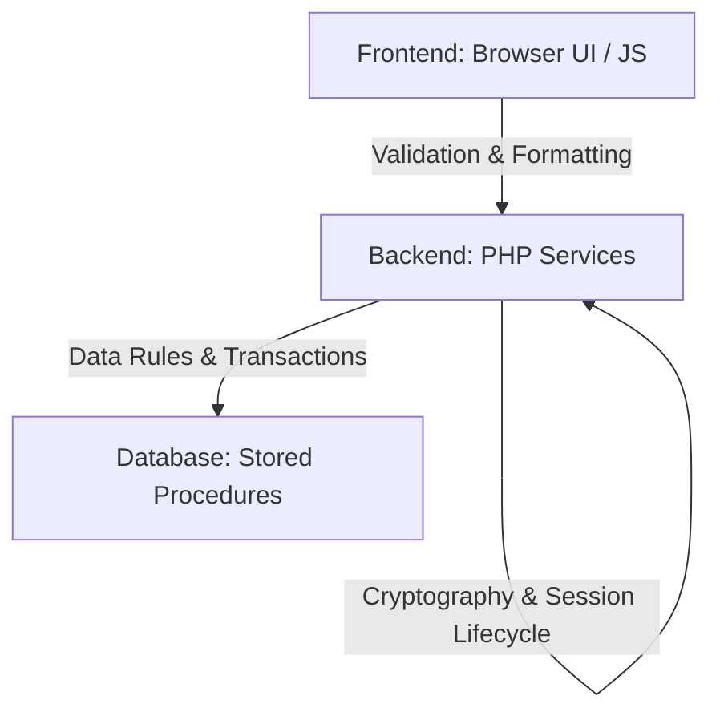

# Stored Procedure Implementation Plan & Architectural Analysis

This document presents a comprehensive analysis and architectural roadmap for introducing Stored Procedures into the **Barangay Sinalhan Patient Management System**. It evaluates performance, security, data integrity, and structural maintainability to ensure stored procedures are only used where they provide measurable value.

---

## 1. Executive Summary

A thorough review of the Sinalhan Health System database structure reveals a well-indexed relational schema with clean procedural PHP data access via a PDO Singleton. 

While the system performs well in its current state, several key operations involve multi-query transactions, aggregate calculations, and bulk state transitions that are prime candidates for database-level stored procedures. 

By delegating these workflows to MySQL, we can:
1. **Improve Performance:** Reduce network roundtrips between the web server and database.
2. **Guarantee Data Integrity:** Encapsulate compound operations in transactional database-enforced boundaries.
3. **Enhance Security:** Restrict direct table write privileges, allowing the PHP service layer to execute queries solely through defined interfaces.
4. **Streamline Code Organization:** Eliminate boilerplate SQL from the backend code.

---

## 2. Phase 1: Analysis Report

### 2.1 Database Architecture & Relationships
The database consists of **11 core tables** utilizing the `InnoDB` storage engine, which provides transaction safety (ACID compliance) and foreign key constraints:
- **`users`:** Accounts, role ENUMs, TOTP secrets, theme preferences.
- **`patients`:** Encrypted medical histories and allergies.
- **`service_types`:** Medical service categories and queue ticketing prefixes.
- **`health_records`:** Encrypted consultation details.
- **`vital_signs`:** Patient vitals mapped 1:1 with `health_records`.
- **`appointments`:** Booking logs and status ENUMs.
- **`queue`:** Sequential daily walk-in records.
- **`activity_log`:** Write-only security audit trails.
- **`notifications`:** Dropdown updates and sync warnings.
- **`system_settings`:** Dynamic key-value configuration flags.
- **`consultation_templates`:** Pre-filled consultation templates.

### 2.2 Frequently Executed Operations
1. **Queue Ticket Generation:** Assigning daily sequential tickets.
2. **Queue Monitor Refresh:** SSE long-polling queries mapping waiting rooms.
3. **Audit Log Inserts:** Appending events to the audit trail during every state change.
4. **Dashboard Stats Compilation:** Running multiple aggregates to render counts.

### 2.3 Performance & Data Integrity Bottlenecks
- **Queue Concurrency:** In peak hours, multiple BHWs assigning queue tickets simultaneously could lead to race conditions when selecting `MAX(queue_number)` and inserting the new record. Although protected by a unique database key (`uk_queue_daily`), a race condition triggers SQL errors on the client. Moving this check-and-insert logic to a single database stored procedure prevents this.
- **Overdue Appointment Batch Updates:** Transitions of past scheduled appointments to `'No-Show'` require retrieving data, running the updates, and logging to the audit trail, causing multiple roundtrips.
- **Unoptimized Statistics:** The dashboard executes multiple distinct queries to build counts. These can be unified into a single stored procedure returning multiple result sets.

---

## 3. Phase 2: Planning & Recommendations

We recommend introducing **five specific stored procedures** where their advantages are clear. We do **not** recommend stored procedures for standard CRUD pages or cryptographic operations.

### Priority Matrix

| Category | Priority | Recommended Stored Procedure | Business Justification |
| :--- | :--- | :--- | :--- |
| **Queue Management** | **High** | `sp_assign_queue_ticket` | Prevents ticketing race conditions, handles daily sequence resets, and formats prefixes in a single database lock. |
| **Audit Logging** | **High** | `sp_log_activity` | Provides a unified, write-only interface for logging audit trail events. |
| **Dashboard Statistics** | **Medium** | `sp_get_dashboard_stats` | Consolidates multiple aggregate queries into a single call, speeding up dashboard rendering. |
| **Appointment Management** | **Medium** | `sp_resolve_overdue_appointments` | Handles batch state transitions and logs changes to the audit trail in a single transaction. |
| **Queue Management** | **Low** | `sp_update_queue_status` | Standardizes status transitions (`Waiting` -> `Serving` -> `Served`) and updates timestamps. |
| **Key Rotation** | **Not Recommended** | N/A | Cryptographic key rotation relies on PHP's `OpenSSL` extension and file write access. It **must** remain in the backend services. |

---

## 4. Phase 3: Architectural Logic Distribution

Determining where business logic should reside is critical for long-term maintainability:



### 1. Presentation & Input Validation (Frontend)
- **Logic Location:** Client-Side Javascript.
- **Rationale:** Immediate feedback (e.g., matching phone formats, preventing future birthdates) must occur before hitting the server to maximize usability.

### 2. Encryption, 2FA, & Session Security (Backend Services)
- **Logic Location:** PHP Backend.
- **Rationale:** Operations requiring encryption keys (`ENCRYPTION_KEY`), session lifecycle checks, or TOTP verification should never occur inside the database layer. Databases should store ciphertext but not manage keys.

### 3. Transaction Safety, Sequencing, & Multi-Table Operations (Database)
- **Logic Location:** Database Stored Procedures.
- **Rationale:** Sequential numbering, bulk status updates, and write-only logging are best handled at the database level to ensure ACID compliance.

---

## 5. Phase 4: Implementation Strategy

### 5.1 Migration & Rollout
1. **Schema Update:** Deploy stored procedures to MySQL using database migrations or setup SQL files.
2. **Refactoring Phase:** Update one PHP controller at a time (starting with logging, then queue, then appointments).
3. **Phased Rollout:** Deploy changes to a staging server under simulated concurrent load before deploying to production.

### 5.2 Error & Transaction Management
- Use `DECLARE EXIT HANDLER FOR SQLEXCEPTION` within stored procedures to automatically rollback active transactions if a query fails.
- Pass error codes back to PHP to allow the backend to flash descriptive SweetAlert alerts to users.

### 5.3 Rollback Strategy
Keep a backup script containing the original raw SQL queries. If a stored procedure causes issues, developers can revert the PHP files to the previous commits.

---

## 6. Phase 5: Examples & Code Integration

Below is the complete implementation details for the three most critical stored procedures.

---

### Candidate 1: Audit Logging (`sp_log_activity`)
- **Justification:** Standardizes audit trail writes securely.
- **Tables Involved:** `activity_log`

#### SQL Implementation
```sql
DELIMITER //

CREATE PROCEDURE sp_log_activity(
    IN p_user_id INT,
    IN p_action VARCHAR(255),
    IN p_module VARCHAR(50),
    IN p_record_id INT,
    IN p_details TEXT,
    IN p_ip_address VARCHAR(45)
)
BEGIN
    INSERT INTO activity_log (user_id, action, module, record_id, details, ip_address)
    VALUES (p_user_id, p_action, p_module, p_record_id, p_details, p_ip_address);
END //

DELIMITER ;
```

#### PHP Service Layer Call (`includes/log_activity.php`)
```php
function log_activity($pdo, $action, $module, $record_id = null, $details = null) {
    try {
        $userId = $_SESSION['user_id'] ?? null;
        $ipAddress = $_SERVER['REMOTE_ADDR'] ?? '127.0.0.1';

        // Execute the stored procedure
        $stmt = $pdo->prepare("CALL sp_log_activity(?, ?, ?, ?, ?, ?)");
        $stmt->execute([
            $userId,
            $action,
            $module,
            $record_id,
            $details,
            $ipAddress
        ]);
    } catch (PDOException $e) {
        error_log("Failed to log activity via stored procedure: " . $e->getMessage());
    }
}
```

---

### Candidate 2: Queue Ticket Assignment (`sp_assign_queue_ticket`)
- **Justification:** Solves ticket sequence race conditions under peak walk-in load.
- **Tables Involved:** `queue`, `service_types`, `patients`

#### SQL Implementation
```sql
DELIMITER //

CREATE PROCEDURE sp_assign_queue_ticket(
    IN p_patient_id INT,
    IN p_service_id INT,
    IN p_assigned_by INT,
    OUT p_ticket_string VARCHAR(20),
    OUT p_queue_number INT
)
BEGIN
    DECLARE v_prefix VARCHAR(10);
    DECLARE v_next_num INT;
    DECLARE v_today DATE;
    
    -- Handler to roll back transactions on SQLEXCEPTION
    DECLARE EXIT HANDLER FOR SQLEXCEPTION
    BEGIN
        ROLLBACK;
        SIGNAL SQLSTATE '45000' SET MESSAGE_TEXT = 'Failed to assign queue ticket.';
    END;

    SET v_today = CURDATE();

    START TRANSACTION;

    -- 1. Verify patient exists and is active
    IF NOT EXISTS (SELECT 1 FROM patients WHERE patient_id = p_patient_id AND is_archived = 0) THEN
        SIGNAL SQLSTATE '45000' SET MESSAGE_TEXT = 'Patient record not found or archived.';
    END IF;

    -- 2. Fetch service type ticketing prefix
    SELECT COALESCE(prefix, 'Q') INTO v_prefix 
    FROM service_types 
    WHERE service_id = p_service_id AND is_active = 1;
    
    IF v_prefix IS NULL THEN
        SET v_prefix = 'Q';
    END IF;

    -- 3. Calculate next sequential ticket number under a table lock (for concurrency safety)
    SELECT COALESCE(MAX(queue_number), 0) + 1 INTO v_next_num
    FROM queue WITH (XLOCK, ROWLOCK)
    WHERE queue_date = v_today;

    -- 4. Insert queue ticket
    INSERT INTO queue (patient_id, service_id, queue_date, queue_number, status, assigned_by)
    VALUES (p_patient_id, p_service_id, v_today, v_next_num, 'Waiting', p_assigned_by);

    -- 5. Format outputs
    SET p_queue_number = v_next_num;
    SET p_ticket_string = CONCAT(v_prefix, '-', LPAD(v_next_num, 3, '0'));

    COMMIT;
END //

DELIMITER ;
```

#### PHP Controller Integration (`queue/add_process.php`)
```php
// Prepare output variables using MySQL session variables
$stmt = $pdo->prepare("CALL sp_assign_queue_ticket(?, ?, ?, @ticket_str, @q_num)");
$stmt->execute([$patientId, $serviceId, $_SESSION['user_id']]);

// Fetch the output values
$output = $pdo->query("SELECT @ticket_str AS ticket, @q_num AS num")->fetch();
$ticketString = $output['ticket'];
$queueNumber = $output['num'];

// Log activity to audit trail
log_activity($pdo, "Generated queue ticket '{$ticketString}'", 'Queue', $patientId);
```

---

### Candidate 3: Overdue Appointments Batch Status Resolution (`sp_resolve_overdue_appointments`)
- **Justification:** Encapsulates batch updates and logging in a single database trip.
- **Tables Involved:** `appointments`, `activity_log`

#### SQL Implementation
```sql
DELIMITER //

CREATE PROCEDURE sp_resolve_overdue_appointments(
    IN p_admin_id INT,
    OUT p_resolved_count INT
)
BEGIN
    DECLARE v_updated INT DEFAULT 0;
    DECLARE v_today DATE;

    DECLARE EXIT HANDLER FOR SQLEXCEPTION
    BEGIN
        ROLLBACK;
        SIGNAL SQLSTATE '45000' SET MESSAGE_TEXT = 'Failed to execute batch appointment resolution.';
    END;

    SET v_today = CURDATE();

    START TRANSACTION;

    -- 1. Perform bulk transition
    UPDATE appointments 
    SET status = 'No-Show' 
    WHERE appointment_date < v_today 
      AND status = 'Scheduled' 
      AND is_archived = 0;
      
    SET v_updated = ROW_COUNT();

    -- 2. Log to audit trail if records were updated
    IF v_updated > 0 THEN
        INSERT INTO activity_log (user_id, action, module, details) 
        VALUES (p_admin_id, 'Update', 'Appointment', CONCAT('Batch resolved ', v_updated, ' overdue appointments as No-Show.'));
    END IF;

    SET p_resolved_count = v_updated;

    COMMIT;
END //

DELIMITER ;
```

#### PHP Integration (`appointments/auto_noshow.php`)
```php
try {
    $pdo = Database::getInstance()->getConnection();
    
    // Call batch stored procedure
    $stmt = $pdo->prepare("CALL sp_resolve_overdue_appointments(?, @resolved_count)");
    $stmt->execute([$_SESSION['user_id']]);
    
    // Fetch result
    $resolvedCount = $pdo->query("SELECT @resolved_count")->fetchColumn();
    
    if ($resolvedCount > 0) {
        $_SESSION['success_msg'] = "Successfully resolved {$resolvedCount} past-due appointments as 'No-Show'.";
    } else {
        $_SESSION['info_msg'] = "No past-due scheduled appointments were found.";
    }
} catch (Exception $e) {
    error_log("Batch auto no-show update failed: " . $e->getMessage());
    $_SESSION['error_msg'] = "Error during batch update: " . $e->getMessage();
}
```

---

## 7. Development Estimation & Roadmap

- **Estimated Total Effort:** **18 - 24 Development Hours**
- **Staging / QA Testing:** **6 Hours**
- **Deployment & Handover:** **2 Hours**

### Implementation Order
1. **Week 1 (High Priority):** Deploy `sp_log_activity` and `sp_assign_queue_ticket` to eliminate concurrency errors.
2. **Week 2 (Medium Priority):** Deploy `sp_resolve_overdue_appointments` and `sp_get_dashboard_stats`.
